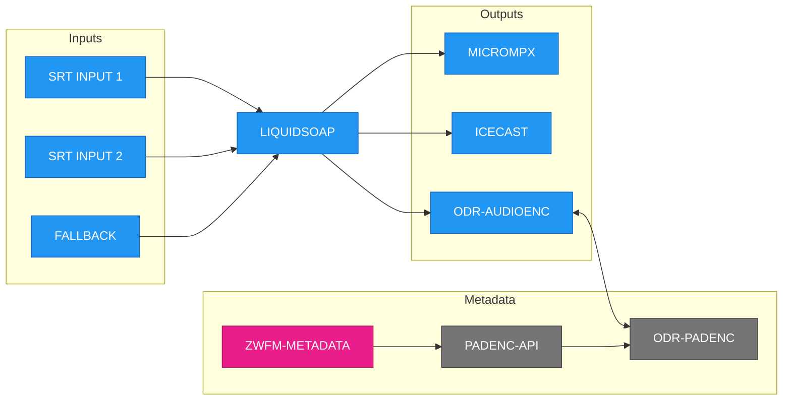

# zwfm-liquidsoap

[](https://github.com/oszuidwest/zwfm-liquidsoap/actions/workflows/ci.yml)
[](https://github.com/oszuidwest/zwfm-liquidsoap/actions/workflows/docker.yml)

This repository contains a professional-grade audio streaming solution originally built for [ZuidWest FM](https://www.zuidwestfm.nl/), [Radio Rucphen](https://www.rucphenrtv.nl/), and [BredaNu](https://www.bredanu.nl/) in the Netherlands. Using [Liquidsoap](https://www.liquidsoap.info) as its core, it provides:

- **High-availability streaming** with automatic failover between multiple inputs
- **Professional audio processing** via StereoTool (optional)
- **Multiple output formats**: Icecast streaming (MP3/AAC), DAB+ encoding, and MicroMPX for FM transmitters
- **Docker-based deployment** for easy installation and management

While originally designed for these three Dutch radio stations, the system is fully configurable for any radio station's needs.



## System Design

The system delivers audio through dual redundant pathways. Liquidsoap prioritizes the main input (SRT 1). If it becomes unavailable or silent, the system automatically switches to SRT 2. Should both inputs fail, it falls back to an emergency audio file (configured via `EMERGENCY_AUDIO_PATH`). For maximum reliability, both inputs should receive the same broadcast via separate network paths.

### Components

1. **Liquidsoap**: Core audio processing engine - handles input switching, fallback logic, and encoding
2. **Icecast**: Public streaming server for distributing MP3/AAC streams to listeners
3. **StereoTool**: Professional audio processor and [MicroMPX](https://www.thimeo.com/micrompx/) encoder for FM transmitters (optional, requires license)
4. **ODR-AudioEnc**: DAB+ audio encoder for digital radio broadcasting (optional)

### Related Projects

1. **[rpi-audio-encoder](https://github.com/oszuidwest/rpi-audio-encoder)**: Turn a Raspberry Pi into a production-grade SRT audio encoder for studio connections
2. **[rpi-umpx-decoder](https://github.com/oszuidwest/rpi-umpx-decoder)**: Turn a Raspberry Pi into a μMPX decoder for FM transmitter sites
3. **[ODR-PadEnc](https://github.com/Opendigitalradio/ODR-PadEnc)**: Programme Associated Data encoder for DAB+ metadata
4. **[padenc-api](https://github.com/oszuidwest/padenc-api)**: REST API server for managing DAB+ metadata
5. **[zwfm-metadata](https://github.com/oszuidwest/zwfm-metadata)**: Metadata routing middleware for now-playing information

## Getting Started

### Requirements

- Linux server (Ubuntu 24.04 or Debian 12 recommended)
- Docker and Docker Compose installed
- x86_64 or ARM64 architecture
- At least 2GB RAM and 10GB disk space
- Network connectivity for SRT streams
- `socat` for runtime control via server socket (optional)

### Quick Install

```bash
# Install Liquidsoap
/bin/bash -c "$(curl -fsSL https://raw.githubusercontent.com/oszuidwest/zwfm-liquidsoap/main/install.sh)"
```

### Configuration

After installation, edit the environment file at `/opt/liquidsoap/.env` to configure your station settings. Example configuration files are provided:

- `.env.zuidwest.example` - Basic configuration without DME
- `.env.rucphen.example` - Configuration with DME output
- `.env.bredanu.example` - Configuration with DME output

Copy the appropriate example file to `.env` and customize it for your station. Most configuration variables are centralized in `conf/lib/00_settings.liq`. Station-specific files only contain DME configuration (for Rucphen/BredaNu).

## Environment Variables Reference

This table lists ALL environment variables used in the system. Variables without defaults are **required** and will cause Liquidsoap to fail if not set.

| Variable                          | Description                                      | Default                      | Example                                                         | Used In                                | Station         |
| --------------------------------- | ------------------------------------------------ | ---------------------------- | --------------------------------------------------------------- | -------------------------------------- | --------------- |
| **Station Configuration**         |
| `STATION_ID`                      | Unique station identifier (lowercase, no spaces) | _(required)_                 | `zuidwest`                                                      | `conf/lib/00_settings.liq`             | All             |
| `STATION_NAME`                    | Full station name for metadata                   | _(required)_                 | `ZuidWest FM`                                                   | `conf/lib/00_settings.liq`             | All             |
| **Icecast Configuration**         |
| `ICECAST_HOST`                    | Icecast server hostname                          | _(required)_                 | `icecast.zuidwest.cloud`                                        | `conf/lib/00_settings.liq`             | All             |
| `ICECAST_PORT`                    | Icecast server port                              | _(required)_                 | `8000`                                                          | `conf/lib/00_settings.liq`             | All             |
| `ICECAST_SOURCE_PASSWORD`         | Icecast source password                          | _(required)_                 | `s3cur3p4ss`                                                    | `conf/lib/00_settings.liq`             | All             |
| `ICECAST_MOUNT_BASE`              | Base mount point name                            | `STATION_ID`                 | `zuidwest`                                                      | `conf/lib/00_settings.liq`             | All             |
| **Stream Mount Points**           |
| `ICECAST_MOUNT_MP3`               | MP3 stream mount                                 | `/#{ICECAST_MOUNT_BASE}.mp3` | `/zuidwest.mp3`                                                 | `conf/lib/00_settings.liq`             | All             |
| `ICECAST_MOUNT_AAC_LOW`           | AAC mobile stream mount                          | `/#{ICECAST_MOUNT_BASE}.aac` | `/zuidwest.aac`                                                 | `conf/lib/00_settings.liq`             | All             |
| `ICECAST_MOUNT_AAC_HIGH`          | AAC STL stream mount                             | `/#{ICECAST_MOUNT_BASE}.stl` | `/zuidwest.stl`                                                 | `conf/lib/00_settings.liq`             | All             |
| **Stream Bitrates**               |
| `ICECAST_BITRATE_MP3`             | MP3 stream bitrate (kbps)                        | `192`                        | `256`                                                           | `conf/lib/00_settings.liq`             | All             |
| `ICECAST_BITRATE_AAC_LOW`         | Low AAC bitrate (kbps)                           | `96`                         | `64`                                                            | `conf/lib/00_settings.liq`             | All             |
| `ICECAST_BITRATE_AAC_HIGH`        | High AAC bitrate (kbps)                          | `576`                        | `320`                                                           | `conf/lib/00_settings.liq`             | All             |
| **SRT Studio Inputs**             |
| `SRT_PASSPHRASE`                  | SRT encryption passphrase                        | _(required)_                 | `alpha-bravo-charlie-delta`                                     | `conf/lib/00_settings.liq`             | All             |
| `SRT_PORT_PRIMARY`                | Primary SRT listening port                       | `8888`                       | `8888`                                                          | `conf/lib/00_settings.liq`             | All             |
| `SRT_PORT_SECONDARY`              | Secondary SRT listening port                     | `9999`                       | `9999`                                                          | `conf/lib/00_settings.liq`             | All             |
| **Audio Processing**              |
| `STEREOTOOL_LICENSE`              | StereoTool license key                           | _(none)_                     | `ABC123DEF456...`                                               | `conf/lib/00_settings.liq`             | All             |
| `STEREOTOOL_WEB_PORT`             | StereoTool web interface port                    | `8080`                       | `8080`                                                          | `conf/lib/00_settings.liq`             | All             |
| **Fallback & Control**            |
| `SERVER_SOCKET_ENABLED`           | Enable Unix socket for runtime control           | `true`                       | `true`                                                          | `conf/lib/90_server.liq`               | All             |
| `SERVER_SOCKET_PATH`              | Unix socket file path                            | `/tmp/liquidsoap/liquidsoap.sock` | `/tmp/liquidsoap/liquidsoap.sock`                          | `conf/lib/90_server.liq`               | All             |
| `EMERGENCY_AUDIO_PATH`            | Fallback audio file when all inputs fail         | `/audio/fallback.ogg`        | `/audio/noodband.mp3`                                           | `conf/lib/00_settings.liq`             | All             |
| `SILENCE_SWITCH_SECONDS`          | Max silence duration (seconds)                   | `15.0`                       | `20.0`                                                          | `conf/lib/00_settings.liq`             | All             |
| `AUDIO_VALID_SECONDS`             | Min audio duration (seconds)                     | `15.0`                       | `10.0`                                                          | `conf/lib/00_settings.liq`             | All             |
| **DAB+ Configuration (Optional)** |
| `DAB_BITRATE`                     | DAB+ encoder bitrate                             | _(none)_                     | `128`                                                           | `conf/lib/00_settings.liq`             | All             |
| `DAB_EDI_DESTINATIONS`            | DAB+ EDI destination(s)                          | _(none)_                     | `tcp://dab-mux.local:9001` or `tcp://dab1:9001,tcp://dab2:9002` | `conf/lib/00_settings.liq`             | All             |
| `DAB_METADATA_SIZE`               | PAD size in bytes (0-196)                        | `8` when socket is set       | `16`                                                            | `conf/lib/00_settings.liq`             | All             |
| `DAB_METADATA_SOCKET`             | PAD metadata socket path                         | _(none)_                     | `padenc.sock`                                                   | `conf/lib/00_settings.liq`             | All             |
| **DME Configuration**             |
| `DME_PRIMARY_HOST`                | Primary DME server                               | _(required)_                 | `ingest1.dme.nl`                                                | `conf/rucphen.liq`, `conf/bredanu.liq` | Rucphen/BredaNu |
| `DME_PRIMARY_PORT`                | Primary DME port                                 | _(required)_                 | `8010`                                                          | `conf/rucphen.liq`, `conf/bredanu.liq` | Rucphen/BredaNu |
| `DME_PRIMARY_USER`                | Primary DME username                             | _(required)_                 | `rucphen-live`                                                  | `conf/rucphen.liq`, `conf/bredanu.liq` | Rucphen/BredaNu |
| `DME_PRIMARY_PASSWORD`            | Primary DME password                             | _(required)_                 | `dme123pass`                                                    | `conf/rucphen.liq`, `conf/bredanu.liq` | Rucphen/BredaNu |
| `DME_SECONDARY_HOST`              | Secondary DME server                             | _(required)_                 | `ingest2.dme.nl`                                                | `conf/rucphen.liq`, `conf/bredanu.liq` | Rucphen/BredaNu |
| `DME_SECONDARY_PORT`              | Secondary DME port                               | _(required)_                 | `8020`                                                          | `conf/rucphen.liq`, `conf/bredanu.liq` | Rucphen/BredaNu |
| `DME_SECONDARY_USER`              | Secondary DME username                           | _(required)_                 | `bredanu-backup`                                                | `conf/rucphen.liq`, `conf/bredanu.liq` | Rucphen/BredaNu |
| `DME_SECONDARY_PASSWORD`          | Secondary DME password                           | _(required)_                 | `backup456pwd`                                                  | `conf/rucphen.liq`, `conf/bredanu.liq` | Rucphen/BredaNu |
| `DME_MOUNT_POINT`                 | DME mount point                                  | _(required)_                 | `/live-stream`                                                  | `conf/rucphen.liq`, `conf/bredanu.liq` | Rucphen/BredaNu |
| **Docker Configuration**          |
| `CONTAINER_TIMEZONE`              | Container timezone                               | `Europe/Amsterdam`           | `Europe/Amsterdam`                                              | `docker-compose.yml`                   | All             |

### Notes:

- **Required variables**: Must be set in `.env` file or Liquidsoap will fail to start
- **Optional features**: DAB+ output is optional - set both `DAB_BITRATE` and `DAB_EDI_DESTINATIONS` to enable. PAD metadata requires `DAB_METADATA_SOCKET`
- **Multiple EDI outputs**: `DAB_EDI_DESTINATIONS` supports comma-separated values for sending to multiple DAB+ destinations simultaneously
- **Station column**: "All" means used by all stations, "Rucphen/BredaNu" means used only by stations with DME
- **Default conventions**: `#{VARIABLE}` means the value is interpolated from another variable
- **PAD sizes**: Valid range 0-196 bytes. Recommendation to use as small of a METADATA_SIZE as possible. 8 bytes is enough to transmit a logo in a couple of seconds (ofcourse, how smaller the filesize the faster the logo will transmit). If you're using artwork, you might need to consider using a bigger METADATA_SIZE.
- **File locations**: Most configuration variables are centralized in `conf/lib/00_settings.liq`
- **Station-specific files**: Only contain DME configuration (for Rucphen/BredaNu) and station-specific logic

### Running with Docker

```bash
cd /opt/liquidsoap

# Start services
docker compose up -d

# View logs
docker compose logs -f

# Stop services
docker compose down
```

### StereoTool GUI

When StereoTool is enabled (by providing a `STEREOTOOL_LICENSE` in the `.env` file), access the web interface at: `http://localhost:8080`

### Audio Processing with StereoTool

StereoTool is always included in the installation. When enabled (by providing a `STEREOTOOL_LICENSE`), the system creates two audio paths:

1. **Unprocessed audio (`radio`)**: The raw combined audio from studios/fallback

2. **Processed audio (`radio_processed`)**: Audio processed by StereoTool
   - Audio processing (AGC, compression, limiting, EQ, etc.)
   - MicroMPX encoding for FM transmitters (available via StereoTool's separate output)

**Note**: The `output.dummy()` call is required to activate StereoTool's processing chain, even though this output isn't used directly.

## Silence Detection

The system includes automatic silence detection that monitors studio inputs and manages fallback behavior. This feature is **enabled by default**.

### How it works

When silence detection is **enabled** (default):

- Studio inputs automatically switch away when silent for more than 15 seconds
- If both studios are silent/disconnected, the system plays the fallback file
- If no fallback file exists, the system plays silence
- Provides automatic redundancy for unattended operation

When silence detection is **disabled**:

- Studio inputs continue playing even when silent and only switch away when disconnected
- No automatic switching between sources
- Fallback file is never used
- Useful for testing or when manual control is preferred

### Configuration

Control silence detection via the server socket (enabled by default):

```bash
# Connect to the server socket
socat - UNIX-CONNECT:/opt/liquidsoap/socket/liquidsoap.sock

# Enable silence detection (default)
silence.enable

# Disable silence detection
silence.disable

# Check current status
silence.status
```

Changes take effect immediately without restarting the service.

### Silence thresholds

The default silence detection parameters can be adjusted via environment variables:

- `SILENCE_SWITCH_SECONDS`: Maximum silence duration in seconds (default: 15.0)
- `AUDIO_VALID_SECONDS`: The minimum duration of continuous audio required for an input to be considered valid (default: 15.0)

## Streaming to SRT Inputs

The system accepts two SRT input streams:

- **Port 8888**: Primary studio input (Studio A)
- **Port 9999**: Secondary studio input (Studio B)

All connections require encryption using the passphrase configured in `SRT_PASSPHRASE`.

### Example: Stream from Audio Device

```bash
# Stream from ALSA audio device (Linux)
ffmpeg -f alsa -channels 2 -sample_rate 48000 -i hw:0 \
  -codec:a pcm_s16le -vn -f matroska \
  "srt://liquidsoap.example.com:8888?passphrase=your_passphrase&mode=caller&transtype=live&latency=10000"

# Stream from file (for testing)
ffmpeg -re -i input.mp3 -c copy -f mpegts \
  "srt://liquidsoap.example.com:8888?passphrase=your_passphrase&mode=caller"
```

For production use, consider using [rpi-audio-encoder](https://github.com/oszuidwest/rpi-audio-encoder) for a dedicated hardware encoder.

### SRT Port Configuration

The SRT listening ports can be customized via environment variables:

- `SRT_PORT_PRIMARY`: Primary studio input port (default: 8888)
- `SRT_PORT_SECONDARY`: Secondary studio input port (default: 9999)

## DAB+ Digital Radio Broadcasting

The system supports optional DAB+ output using ODR-AudioEnc. When configured, it encodes audio for digital radio transmission.

### Configuration

To enable DAB+ output, set these environment variables:

```bash
# Required to enable DAB+
DAB_BITRATE=128                                    # Encoder bitrate in kbps
DAB_EDI_DESTINATIONS=tcp://dab-mux.example.com:9001   # EDI output destination(s)

# Optional PAD metadata
DAB_METADATA_SOCKET=padenc.sock                   # Socket for PAD encoder
DAB_METADATA_SIZE=8                               # PAD size (default: 8)
```

### Multiple EDI Destinations

You can send DAB+ streams to multiple destinations by providing comma-separated URLs:

```bash
DAB_EDI_DESTINATIONS=tcp://primary.example.com:9001,tcp://backup.example.com:9002
```

### PAD (Programme Associated Data)

PAD allows sending metadata like song titles and station logos alongside the audio. Recommendation to use as small of a METADATA_SIZE as possible. 8 bytes is enough to transmit a logo in a couple of seconds (ofcourse, how smaller the filesize the faster the logo will transmit). If you're using artwork, you might need to consider using a bigger METADATA_SIZE.

## DME Integration (Dutch Media Exchange)

Radio Rucphen and BredaNu require DME output for distribution through the Dutch public broadcasting system. DME configuration is handled in station-specific configuration files.

### Required Variables

All DME variables must be set for these stations:

```bash
# Primary ingestion point
DME_PRIMARY_HOST=ingest1.dme.nl
DME_PRIMARY_PORT=8000
DME_PRIMARY_USER=station-live
DME_PRIMARY_PASSWORD=secret

# Secondary ingestion point
DME_SECONDARY_HOST=ingest2.dme.nl
DME_SECONDARY_PORT=8000
DME_SECONDARY_USER=station-backup
DME_SECONDARY_PASSWORD=secret

# Stream mount point
DME_MOUNT_POINT=/live
```

## Advanced Features

### Metadata Integration

For now-playing information and metadata routing, see the [zwfm-metadata](https://github.com/oszuidwest/zwfm-metadata) project.

## Troubleshooting

### Common Issues

**No audio output**

- Check if SRT ports (8888/9999) are accessible through your firewall
- Verify the `SRT_PASSPHRASE` matches between encoder and Liquidsoap
- Check Docker logs: `docker compose logs -f`

**Stream keeps switching sources**

- Increase `SILENCE_SWITCH_SECONDS` for unstable connections
- Check network stability between encoder and server
- Verify encoder is sending continuous audio

**Icecast connection failed**

- Verify `ICECAST_HOST` and `ICECAST_PORT` are correct
- Check `ICECAST_SOURCE_PASSWORD` matches server configuration
- Ensure Icecast server is running and accessible

**StereoTool not processing**

- Verify `STEREOTOOL_LICENSE` is set correctly
- Check web interface at port 8080
- Review Docker logs for license validation errors

### Debug Commands

```bash
# View all logs
docker compose logs -f

# Check service status
docker compose ps

# Restart services
docker compose restart

# Validate configuration
docker run --rm -v "$PWD:/app" -w /app savonet/liquidsoap:v2.4.2 liquidsoap -c conf/*.liq
```

## Development

### Building from Source

```bash
# Clone repository
git clone https://github.com/oszuidwest/zwfm-liquidsoap.git
cd zwfm-liquidsoap

# Build Docker image
docker buildx build --platform linux/amd64,linux/arm64 -t zwfm-liquidsoap:local .

# Run with custom image
docker compose up -d
```

### Contributing

1. Fork the repository
2. Create a feature branch
3. Make your changes
4. Run syntax validation: `docker run --rm -v "$PWD:/app" -w /app savonet/liquidsoap:v2.4.2 liquidsoap -c conf/*.liq`
5. Submit a pull request

## License

Copyright 2025 Omroepstichting ZuidWest & Stichting BredaNu. This project is licensed under the MIT License. See [LICENSE](LICENSE) file for details.

## Acknowledgments

- [Liquidsoap](https://www.liquidsoap.info/) - The amazing audio streaming language
- [Icecast](https://icecast.org/) - Reliable streaming server
- [StereoTool](https://www.stereotool.com/) - Professional audio processing
- [Opendigitalradio](https://www.opendigitalradio.org/) - DAB+ tools and community

