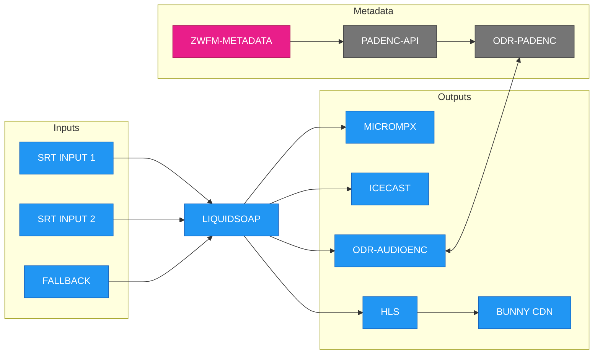

# zwfm-liquidsoap

[](https://github.com/oszuidwest/zwfm-liquidsoap/actions/workflows/ci.yml)
[](https://github.com/oszuidwest/zwfm-liquidsoap/actions/workflows/docker.yml)

This repository contains an audio streaming system for radio broadcast. We made it for [ZuidWest FM](https://www.zuidwestfm.nl/), [Radio Rucphen](https://www.rucphenrtv.nl/), and [BredaNu](https://www.bredanu.nl/) in the Netherlands. The system uses [Liquidsoap](https://www.liquidsoap.info) as its core.

The system has these functions:

- **High availability**: automatic failover between two studio inputs and an emergency source
- **Audio processing**: StereoTool processes the audio (optional)
- **Many output formats**: Icecast (MP3/AAC), HLS, DAB+, and MicroMPX for FM transmitters
- **Docker deployment**: easy installation and management in one container

The system is not limited to these three stations. You can configure it for your own station.


```mermaid
flowchart LR
    subgraph inputs [" Inputs "]
        SRT1["SRT INPUT 1"]
        SRT2["SRT INPUT 2"]
        FALLBACK["FALLBACK"]
    end

    LIQUIDSOAP["LIQUIDSOAP"]

    subgraph outputs [" Outputs "]
        MICROMPX["MICROMPX"]
        ICECAST["ICECAST"]
        HLS["HLS"]
        BUNNY["BUNNY CDN"]
        ODR["ODR-AUDIOENC"]
    end

    subgraph metadata [" Metadata "]
        PADENC["ODR-PADENC"]
        PADAPI["PADENC-API"]
        ZWFM["ZWFM-METADATA"]
    end

    SRT1 --> LIQUIDSOAP
    SRT2 --> LIQUIDSOAP
    FALLBACK --> LIQUIDSOAP

    LIQUIDSOAP --> MICROMPX
    LIQUIDSOAP --> ICECAST
    LIQUIDSOAP --> HLS
    HLS --> BUNNY
    LIQUIDSOAP --> ODR

    ODR <--> PADENC
    PADAPI --> PADENC
    ZWFM --> PADAPI

    classDef blue fill:#2196F3,stroke:#1565C0,color:#fff
    classDef gray fill:#757575,stroke:#424242,color:#fff
    classDef pink fill:#E91E8A,stroke:#AD1457,color:#fff

    class SRT1,SRT2,FALLBACK,LIQUIDSOAP,MICROMPX,ICECAST,HLS,BUNNY,ODR blue
    class PADENC,PADAPI gray
    class ZWFM pink
```

## System Design

The system receives audio on two redundant inputs. Liquidsoap uses the main input (SRT 1) first. If SRT 1 stops or becomes silent, the system changes to SRT 2 automatically. If the two inputs fail, the system plays an emergency audio file. The variable `EMERGENCY_AUDIO_PATH` sets the location of this file. For maximum reliability, send the same broadcast to the two inputs through different network paths.

The emergency audio file is mandatory in production. At startup, Liquidsoap makes sure that the file exists and that it can decode the file. If this check fails, Liquidsoap does not start. This behavior prevents a deployment that has no safety net. For development or tests without an audio file, set `EMERGENCY_ALLOW_BLANK=true`. This setting permits a silent fallback.

### Components

1. **Liquidsoap**: the core audio engine. It switches the inputs, controls the fallback logic, and encodes the audio.
2. **Icecast**: the public stream server. It sends the MP3 and AAC streams to the listeners.
3. **HLS**: optional HTTP Live Streaming output. The system copies it to Bunny Edge Storage, and Bunny CDN serves it.
4. **StereoTool**: audio processor and [MicroMPX](https://www.thimeo.com/micrompx/) encoder for FM transmitters (optional, a license is necessary).
5. **ODR-AudioEnc**: DAB+ audio encoder for digital radio (optional).

### Related Projects

1. **[rpi-audio-encoder](https://github.com/oszuidwest/rpi-audio-encoder)**: makes a Raspberry Pi an SRT audio encoder for studio connections
2. **[rpi-umpx-decoder](https://github.com/oszuidwest/rpi-umpx-decoder)**: makes a Raspberry Pi a MicroMPX decoder for FM transmitter sites
3. **[ODR-PadEnc](https://github.com/Opendigitalradio/ODR-PadEnc)**: encoder for DAB+ Programme Associated Data (PAD)
4. **[padenc-api](https://github.com/oszuidwest/padenc-api)**: REST API server that controls DAB+ metadata
5. **[zwfm-metadata](https://github.com/oszuidwest/zwfm-metadata)**: middleware that routes now-playing metadata

## Installation

### Requirements

- Linux server (we recommend Ubuntu 24.04 or Debian 13)
- Docker and Docker Compose
- x86_64 or ARM64 architecture
- A minimum of 2 GB RAM and 10 GB disk space
- Network connectivity for the SRT streams
- `socat` for runtime control through the server socket (the installer installs it)

### Quick Install

```bash
# Install Liquidsoap
/bin/bash -c "$(curl -fsSL https://raw.githubusercontent.com/oszuidwest/zwfm-liquidsoap/main/install.sh)"
```

### Configuration

After the installation, edit the environment file `/opt/liquidsoap/.env`. This file contains the station settings. These example files are available:

- `.env.zuidwest.example` - basic configuration without DME
- `.env.rucphen.example` - configuration with DME output
- `.env.bredanu.example` - configuration with DME output

Copy the applicable example file to `.env`. Then change the values for your station. The file `conf/lib/00_settings.liq` reads almost all variables. The station files contain only the DME configuration (for Rucphen and BredaNu).

## Environment Variables Reference

This table shows all environment variables in the system. You must set each variable that shows _(required)_. If you do not set one of these variables, Liquidsoap does not start. The DME variables are necessary only for Rucphen and BredaNu. A variable that shows _(none)_ is optional. Set it only if you use the related function.

| Variable                          | Description                                            | Default                           | Example                                                         | Used In                                | Station         |
| --------------------------------- | ------------------------------------------------------ | --------------------------------- | --------------------------------------------------------------- | -------------------------------------- | --------------- |
| **Station Configuration**         | | | | | |
| `STATION_ID`                      | Unique station identifier (lowercase, no spaces)       | _(required)_                      | `zuidwest`                                                      | `conf/lib/00_settings.liq`             | All             |
| `STATION_NAME`                    | Full station name for metadata                         | _(required)_                      | `ZuidWest FM`                                                   | `conf/lib/00_settings.liq`             | All             |
| **Icecast Configuration**         | | | | | |
| `ICECAST_HOST`                    | Icecast server hostname                                | _(required)_                      | `icecast.zuidwest.cloud`                                        | `conf/lib/00_settings.liq`             | All             |
| `ICECAST_PORT`                    | Icecast server port                                    | _(required)_                      | `8000`                                                          | `conf/lib/00_settings.liq`             | All             |
| `ICECAST_SOURCE_PASSWORD`         | Icecast source password                                | _(required)_                      | `s3cur3p4ss`                                                    | `conf/lib/00_settings.liq`             | All             |
| `ICECAST_MOUNT_BASE`              | Base mount point name                                  | `STATION_ID`                      | `zuidwest`                                                      | `conf/lib/00_settings.liq`             | All             |
| **Stream Mount Points**           | | | | | |
| `ICECAST_MOUNT_MP3`               | MP3 stream mount                                       | `/#{ICECAST_MOUNT_BASE}.mp3`      | `/zuidwest.mp3`                                                 | `conf/lib/00_settings.liq`             | All             |
| `ICECAST_MOUNT_AAC_LOW`           | AAC mobile stream mount                                | `/#{ICECAST_MOUNT_BASE}.aac`      | `/zuidwest.aac`                                                 | `conf/lib/00_settings.liq`             | All             |
| `ICECAST_MOUNT_AAC_HIGH`          | AAC STL stream mount                                   | `/#{ICECAST_MOUNT_BASE}.stl`      | `/zuidwest.stl`                                                 | `conf/lib/00_settings.liq`             | All             |
| **Stream Bitrates**               | | | | | |
| `ICECAST_BITRATE_MP3`             | MP3 stream bitrate (kbps)                              | `192`                             | `256`                                                           | `conf/lib/00_settings.liq`             | All             |
| `ICECAST_BITRATE_AAC_LOW`         | Low AAC bitrate (kbps)                                 | `96`                              | `64`                                                            | `conf/lib/00_settings.liq`             | All             |
| `ICECAST_BITRATE_AAC_HIGH`        | High AAC bitrate (kbps)                                | `576`                             | `320`                                                           | `conf/lib/00_settings.liq`             | All             |
| **SRT Studio Inputs**             | | | | | |
| `SRT_PASSPHRASE`                  | SRT encryption passphrase                              | _(required)_                      | `alpha-bravo-charlie-delta`                                     | `conf/lib/00_settings.liq`             | All             |
| `SRT_BIND`                        | Host address for the two SRT inputs                    | `0.0.0.0`                         | `192.0.2.10`                                                    | `docker-compose.yml`                   | All             |
| `SRT_PORT_PRIMARY`                | Port for the primary SRT input                         | `8888`                            | `8888`                                                          | Liquidsoap and Compose                 | All             |
| `SRT_PORT_SECONDARY`              | Port for the secondary SRT input                       | `9999`                            | `9999`                                                          | Liquidsoap and Compose                 | All             |
| **Audio Processing**              | | | | | |
| `STEREOTOOL_LICENSE`              | StereoTool license key                                 | _(none)_                          | `ABC123DEF456...`                                               | `conf/lib/00_settings.liq`             | All             |
| `STEREOTOOL_WEB_BIND`             | Host address for the StereoTool web interface          | `0.0.0.0`                         | `127.0.0.1`                                                     | `docker-compose.yml`                   | All             |
| `STEREOTOOL_WEB_PORT`             | Host port for the StereoTool web interface             | `8080`                            | `8080`                                                          | `docker-compose.yml`                   | All             |
| **Fallback & Control**            | | | | | |
| `SERVER_SOCKET_ENABLED`           | Unix socket for runtime control (on/off)               | `true`                            | `true`                                                          | `conf/lib/80_server.liq`               | All             |
| `SERVER_SOCKET_PATH`              | Unix socket file path                                  | `/tmp/liquidsoap/liquidsoap.sock` | `/tmp/liquidsoap/liquidsoap.sock`                               | `conf/lib/80_server.liq`               | All             |
| `EMERGENCY_AUDIO_PATH`            | Emergency audio file if all inputs fail                | `/audio/fallback.ogg`             | `/audio/noodband.mp3`                                           | `conf/lib/00_settings.liq`             | All             |
| `EMERGENCY_ALLOW_BLANK`           | Permits a silent fallback (development and tests only) | `false`                           | `true`                                                          | `conf/lib/00_settings.liq`             | All             |
| `SILENCE_SWITCH_SECONDS`          | Maximum silence duration (seconds)                     | `15.0`                            | `20.0`                                                          | `conf/lib/00_settings.liq`             | All             |
| `AUDIO_VALID_SECONDS`             | Minimum duration of continuous audio (seconds)         | `15.0`                            | `10.0`                                                          | `conf/lib/00_settings.liq`             | All             |
| `SILENCE_THRESHOLD`               | Silence limit; audio below this level (dB) is silence  | `-40.0`                           | `-45.0`                                                         | `conf/lib/00_settings.liq`             | All             |
| **DAB+ Configuration (Optional)** | | | | | |
| `DAB_BITRATE`                     | DAB+ encoder bitrate                                   | _(none)_                          | `128`                                                           | `conf/lib/00_settings.liq`             | All             |
| `DAB_EDI_DESTINATIONS`            | DAB+ EDI destination(s)                                | _(none)_                          | `tcp://dab-mux.local:9001` or `tcp://dab1:9001,tcp://dab2:9002` | `conf/lib/00_settings.liq`             | All             |
| `DAB_METADATA_SIZE`               | PAD size in bytes (0-196)                              | `8` when socket is set            | `16`                                                            | `conf/lib/00_settings.liq`             | All             |
| `DAB_METADATA_SOCKET`             | PAD metadata socket path                               | _(none)_                          | `padenc.sock`                                                   | `conf/lib/00_settings.liq`             | All             |
| `DAB_ACK_MONITOR_ENABLED`         | Monitors TCP acknowledgement progress                  | `true`                            | `false`                                                         | `conf/lib/00_settings.liq`             | All             |
| `DAB_ACK_POLL_SECONDS`            | Interval between TCP ACK checks                        | `1.0`                             | `2.0`                                                           | `conf/lib/00_settings.liq`             | All             |
| `DAB_ACK_WARN_SECONDS`            | No-ACK interval before status becomes degraded         | `5`                               | `10`                                                            | `conf/lib/00_settings.liq`             | All             |
| `DAB_ACK_DOWN_SECONDS`            | No-ACK interval before status becomes down             | `15`                              | `30`                                                            | `conf/lib/00_settings.liq`             | All             |
| `DAB_ACK_STARTUP_GRACE_SECONDS`   | Grace period for AudioEnc and its initial TCP session  | `10`                              | `20`                                                            | `conf/lib/00_settings.liq`             | All             |
| **HLS Configuration (Optional)**  | | | | | |
| `HLS_BUNNY_STORAGE_ZONE`          | Bunny Edge Storage zone name                           | _(none)_                          | `zwfm-hls`                                                      | `conf/lib/00_settings.liq`             | All             |
| `HLS_BUNNY_ACCESS_KEY`            | Bunny Edge Storage read/write password                 | _(none)_                          | `secret-storage-password`                                       | `conf/lib/00_settings.liq`             | All             |
| `HLS_BUNNY_ENDPOINT`              | Bunny Edge Storage API endpoint                        | `storage.bunnycdn.com`            | `storage.bunnycdn.com`                                          | `conf/lib/00_settings.liq`             | All             |
| `HLS_DIR`                         | Local HLS output directory (tmpfs mount)               | `/hls`                            | `/hls`                                                          | `conf/lib/00_settings.liq`             | All             |
| `HLS_BITRATE_LOW`                 | Low HLS AAC bitrate in kbps                            | `48`                              | `48`                                                            | `conf/lib/00_settings.liq`             | All             |
| `HLS_BITRATE_MID`                 | Mid HLS AAC bitrate in kbps                            | `96`                              | `96`                                                            | `conf/lib/00_settings.liq`             | All             |
| `HLS_BITRATE_HIGH`                | High HLS AAC bitrate in kbps                           | `192`                             | `192`                                                           | `conf/lib/00_settings.liq`             | All             |
| `HLS_SEGMENT_DURATION`            | HLS segment duration in seconds                        | `4.0`                             | `4.0`                                                           | `conf/lib/00_settings.liq`             | All             |
| `HLS_SEGMENTS`                    | Segments per live playlist                             | `10`                              | `10`                                                            | `conf/lib/00_settings.liq`             | All             |
| `HLS_SEGMENTS_OVERHEAD`           | Extra old segments kept locally                        | `5`                               | `5`                                                             | `conf/lib/00_settings.liq`             | All             |
| **Stream Metadata (Optional)**    | | | | | |
| `STREAM_METADATA_BIND`            | Host address for the metadata API                      | `127.0.0.1`                       | `0.0.0.0`                                                       | `docker-compose.yml`                   | All             |
| `STREAM_METADATA_PORT`            | Port for the shared metadata API                       | `7000`                            | `7000`                                                          | Liquidsoap and Compose                 | All             |
| `STREAM_METADATA_BEARER_TOKEN`    | Bearer token that sets the metadata API to on          | _(none)_                          | `long-random-token`                                             | `conf/lib/00_settings.liq`             | All             |
| **DME Configuration**             | | | | | |
| `DME_PRIMARY_HOST`                | Primary DME server                                     | _(required)_                      | `ingest1.dme.nl`                                                | `conf/rucphen.liq`, `conf/bredanu.liq` | Rucphen/BredaNu |
| `DME_PRIMARY_PORT`                | Primary DME port                                       | _(required)_                      | `8010`                                                          | `conf/rucphen.liq`, `conf/bredanu.liq` | Rucphen/BredaNu |
| `DME_PRIMARY_USER`                | Primary DME username                                   | _(required)_                      | `rucphen-live`                                                  | `conf/rucphen.liq`, `conf/bredanu.liq` | Rucphen/BredaNu |
| `DME_PRIMARY_PASSWORD`            | Primary DME password                                   | _(required)_                      | `dme123pass`                                                    | `conf/rucphen.liq`, `conf/bredanu.liq` | Rucphen/BredaNu |
| `DME_SECONDARY_HOST`              | Secondary DME server                                   | _(required)_                      | `ingest2.dme.nl`                                                | `conf/rucphen.liq`, `conf/bredanu.liq` | Rucphen/BredaNu |
| `DME_SECONDARY_PORT`              | Secondary DME port                                     | _(required)_                      | `8020`                                                          | `conf/rucphen.liq`, `conf/bredanu.liq` | Rucphen/BredaNu |
| `DME_SECONDARY_USER`              | Secondary DME username                                 | _(required)_                      | `bredanu-backup`                                                | `conf/rucphen.liq`, `conf/bredanu.liq` | Rucphen/BredaNu |
| `DME_SECONDARY_PASSWORD`          | Secondary DME password                                 | _(required)_                      | `backup456pwd`                                                  | `conf/rucphen.liq`, `conf/bredanu.liq` | Rucphen/BredaNu |
| `DME_MOUNT_POINT`                 | DME mount point                                        | _(required)_                      | `/live-stream`                                                  | `conf/rucphen.liq`, `conf/bredanu.liq` | Rucphen/BredaNu |
| **Docker Configuration**          | | | | | |
| `CONTAINER_TIMEZONE`              | Container timezone                                     | `Europe/Amsterdam`                | `Europe/Amsterdam`                                              | `docker-compose.yml`                   | All             |

### Notes

- **Required variables**: set each variable that shows _(required)_ in the `.env` file. If you do not set one of them, Liquidsoap does not start. The DME variables apply only to Rucphen and BredaNu.
- **Optional outputs**: DAB+ output is off until you set `DAB_BITRATE` and `DAB_EDI_DESTINATIONS`. HLS output is off until you set `HLS_BUNNY_STORAGE_ZONE` and `HLS_BUNNY_ACCESS_KEY`. PAD metadata is off until you set `DAB_METADATA_SOCKET`.
- **More than one EDI output**: `DAB_EDI_DESTINATIONS` accepts a comma-separated list. The system then sends DAB+ to all destinations at the same time.
- **Station column**: "All" applies to all stations. "Rucphen/BredaNu" applies only to the stations with DME.
- **Default values**: `#{VARIABLE}` means that the value comes from a different variable.
- **PAD size**: the permitted range is 0-196 bytes. Use the smallest possible `DAB_METADATA_SIZE`. A size of 8 bytes can transmit a small logo in some seconds. Small files transmit faster than large files. If you transmit artwork, use a larger size.
- **File locations**: the file `conf/lib/00_settings.liq` contains almost all variables.
- **Station files**: these files contain only the DME configuration (for Rucphen and BredaNu) and station-specific logic.

### Docker Commands

```bash
cd /opt/liquidsoap

# Start the services
docker compose up -d

# Show the logs
docker compose logs -f

# Stop the services
docker compose down
```

### StereoTool GUI

If `STEREOTOOL_LICENSE` is set in the `.env` file, StereoTool is on. Open the web interface at `http://localhost:8080`.

Set `STEREOTOOL_WEB_BIND=127.0.0.1` to limit the interface to the local host. You can also set a different host address. The default is `0.0.0.0` for backward compatibility.

### Audio Processing with StereoTool

The installation always includes StereoTool. If `STEREOTOOL_LICENSE` is set, the system makes two audio paths:

1. **Unprocessed audio (`radio`)**: the raw audio from the studios or the fallback
2. **Processed audio (`radio_processed`)**: the audio after StereoTool processing (AGC, compression, limiter, and EQ). StereoTool also encodes MicroMPX for the FM transmitters through its own output.

## Runtime Control

The Unix socket gives runtime control. A restart of the service is not necessary. The socket is on by default (`SERVER_SOCKET_ENABLED=true`).

### Connect

```bash
socat - UNIX-CONNECT:/opt/liquidsoap/socket/liquidsoap.sock
```

### Available Commands

| Command                     | Description                                                        |
| --------------------------- | ------------------------------------------------------------------ |
| `radio_prod.status`         | Shows the mode (auto/forced) and the active source                 |
| `radio_prod.force studio_a` | Makes Studio A the active source                                   |
| `radio_prod.force studio_b` | Makes Studio B the active source                                   |
| `radio_prod.force fallback` | Makes the emergency fallback the active source                     |
| `radio_prod.auto`           | Sets the system back to automatic fallback mode                    |
| `radio_prod.skip`           | Goes to the next available source                                  |
| `silence.enable`            | Sets silence detection to on                                       |
| `silence.disable`           | Sets silence detection to off                                      |
| `silence.status`            | Shows the silence detection state                                  |
| `dab.status`                | Shows TCP acknowledgement progress for each DAB+ destination       |
| `hls.status`                | Shows the HLS output health (`ok`, `degraded: <reason>`, or `disabled`) |

All commands have an immediate effect.

## Silence Detection

The system has automatic silence detection. It monitors the studio inputs and controls the fallback. This function is **on by default**.

### Operation

If silence detection is **on** (default):

- If a studio input is silent for more than `SILENCE_SWITCH_SECONDS` (default: 15 seconds), the system changes to the next source.
- If the two studios are silent or disconnected, the system plays the emergency file.
- At startup, the system does a check of the emergency file (see [System Design](#system-design) and `EMERGENCY_ALLOW_BLANK`).
- The station can operate without an operator.

If silence detection is **off**:

- A silent studio input continues to play. The system changes only if the input disconnects.
- The system does not change between sources automatically.
- The system does not play the emergency file.
- Use this mode for tests or for manual control.

### Configuration

Use the socket commands `silence.enable`, `silence.disable`, and `silence.status` to control silence detection at runtime (see [Runtime Control](#runtime-control)).

### Silence Thresholds

These environment variables set the silence detection parameters:

- `SILENCE_SWITCH_SECONDS`: the maximum silence duration in seconds (default: 15.0)
- `AUDIO_VALID_SECONDS`: the minimum duration of continuous audio before an input is valid (default: 15.0)
- `SILENCE_THRESHOLD`: the silence limit in dB; audio below this level is silence (default: -40.0)

## Send Audio to the SRT Inputs

The system has two SRT inputs:

- **Port 8888**: primary studio input (Studio A)
- **Port 9999**: secondary studio input (Studio B)

Encryption is mandatory for all connections. Set the passphrase in `SRT_PASSPHRASE`.

### Example: Send a Stream from an Audio Device

```bash
# Send a stream from an ALSA audio device (Linux)
ffmpeg -f alsa -channels 2 -sample_rate 48000 -i hw:0 \
  -codec:a pcm_s16le -vn -f matroska \
  "srt://liquidsoap.example.com:8888?passphrase=your_passphrase&mode=caller&transtype=live&latency=10000"

# Send a stream from a file (for tests)
ffmpeg -re -i input.mp3 -c copy -f mpegts \
  "srt://liquidsoap.example.com:8888?passphrase=your_passphrase&mode=caller"
```

For production, we recommend [rpi-audio-encoder](https://github.com/oszuidwest/rpi-audio-encoder) as a dedicated hardware encoder.

### SRT Port Configuration

These environment variables set the SRT ports:

- `SRT_BIND`: the host address for the two published SRT ports (default: 0.0.0.0)
- `SRT_PORT_PRIMARY`: the port for the primary studio input (default: 8888)
- `SRT_PORT_SECONDARY`: the port for the secondary studio input (default: 9999)

Set a specific address in `SRT_BIND` if studio traffic must enter on one host interface only. This variable controls the published host address in Docker. Liquidsoap continues to listen on the container ports.

## DAB+ Digital Radio

The system has an optional DAB+ output through ODR-AudioEnc. This output encodes the audio for digital radio transmission.

### Configuration

The DAB+ output is off until you set these environment variables:

```bash
# Mandatory for the DAB+ output
DAB_BITRATE=128                                    # Encoder bitrate in kbps
DAB_EDI_DESTINATIONS=tcp://dab-mux.example.com:9001   # EDI output destination(s)

# Optional PAD metadata
DAB_METADATA_SOCKET=padenc.sock                   # Socket for the PAD encoder
DAB_METADATA_SIZE=8                               # PAD size (default: 8)

# Optional TCP acknowledgement thresholds
DAB_ACK_WARN_SECONDS=5                            # Degraded after no ACK progress
DAB_ACK_DOWN_SECONDS=15                           # Down after no ACK progress
```

### More Than One EDI Destination

To send the DAB+ stream to more than one destination, write a comma-separated list:

```bash
DAB_EDI_DESTINATIONS=tcp://primary.example.com:9001,tcp://backup.example.com:9002
```

### TCP Acknowledgement Monitoring

TCP acknowledgement monitoring is on by default. It reads the Linux TCP state
for each AudioEnc destination. It checks that `bytes_acked` continues to increase
while AudioEnc sends data. It also reports the TCP state, send queue, unacknowledged
segments, and retransmissions.

Use the Liquidsoap server socket to see the current state:

```text
dab.status
```

A healthy response resembles:

```text
ok
tcp://primary.example.com:9001 ok (TCP ESTAB, ack_age=0s, bytes_sent=123456, bytes_acked=123457, send_queue=0, unacked=0, retrans=0)
```

Possible overall states are:

- `starting`: AudioEnc or its first TCP session is still starting.
- `ok`: every TCP destination has recent acknowledgement progress.
- `degraded`: one destination is unhealthy, or acknowledgements have stopped for
  longer than `DAB_ACK_WARN_SECONDS`.
- `down`: AudioEnc is not running, all TCP destinations are down, or acknowledgement
  progress has stopped for longer than `DAB_ACK_DOWN_SECONDS`.
- `unmonitored`: monitoring is disabled or no TCP EDI destination is configured.

TCP acknowledgements confirm that the remote TCP stack accepted the byte stream.
They do not confirm that the remote DabMux application processed the audio. UDP
destinations cannot provide this signal and are listed as unmonitored.

### PAD (Programme Associated Data)

PAD sends metadata together with the audio. Examples are song titles and station logos. Use the smallest possible `DAB_METADATA_SIZE`. A size of 8 bytes can transmit a small logo in some seconds. Small files transmit faster than large files. If you transmit artwork, use a larger size.

## Shared Stream Metadata

If `STREAM_METADATA_BEARER_TOKEN` is set, Liquidsoap accepts now-playing updates. The endpoint is `POST /metadata` on `STREAM_METADATA_PORT`. The system inserts the metadata into the main radio source. This point is before the processing and the output fan-out. As a result, one update goes to all compatible stream outputs:

- the Icecast MP3 and AAC mounts
- the DME Icecast mounts for Radio Rucphen and BredaNu
- the HLS variants, as timed ID3 in each MPEG-TS segment

DAB+ PAD and StereoTool/RDS stay protocol-specific metadata outputs. DAB uses the configured PAD socket. StereoTool receives its metadata through its API. These two outputs do not use the Liquidsoap source metadata.

Each metadata producer can call the endpoint. Example:

```bash
curl http://127.0.0.1:7000/metadata \
  --request POST \
  --header "Authorization: Bearer ${STREAM_METADATA_BEARER_TOKEN}" \
  --header "Content-Type: application/json" \
  --data '{"title":"Song title","artist":"Artist name"}'
```

The rules are: a `title` that is not empty, an optional `artist`, and the correct bearer token.

The endpoint returns `204 No Content` if the update is correct. It returns `400 Bad Request` if the JSON body is invalid or `title` is missing. It returns `401 Unauthorized` if the bearer token is missing or wrong. The `401` response includes the `WWW-Authenticate: Bearer realm="metadata"` header. It returns `413 Payload Too Large` if the body is larger than 16 KiB or has a `Transfer-Encoding` header. Chunked bodies are not supported. If you do not send `artist`, the update contains only the title. If no bearer token is set, the endpoint is not registered; connection failures are then normal. If the endpoint does not respond, do a check of the container health, the bind address, the port, and the firewall rules.

As an option, configure one URL output in [zwfm-metadata](https://github.com/oszuidwest/zwfm-metadata). Set the input priority, the filters, and the delay:

```json
{
  "type": "url",
  "name": "liquidsoap-stream-metadata",
  "inputs": ["radio-live", "radio-automation", "default-text"],
  "formatters": [],
  "settings": {
    "delay": 0,
    "url": "http://liquidsoap:7000/metadata",
    "method": "POST",
    "bearerToken": "replace-with-the-same-long-random-token"
  }
}
```

The POST body contains the structured metadata JSON from `zwfm-metadata`. Liquidsoap reads the `title` and `artist` fields and ignores the other fields. With this integration, this one output can replace the direct Icecast metadata outputs for the mounts of this Liquidsoap instance.

Keep the endpoint on a private network. The Compose configuration binds it to `127.0.0.1` by default. If the two applications operate in containers, attach them to the same Docker network. Then use the service name `liquidsoap`. For a metadata service on a different host, use a private network or a VPN. A TLS reverse proxy is also possible. If you bind to `0.0.0.0`, limit access to the port with a firewall. Do not make the HTTP endpoint available to an unsafe network.

For HLS playback, the players must read the timed ID3 data to show the values. For example, hls.js sends the `FRAG_PARSING_METADATA` event. The native Apple and Android HLS players have equivalent callbacks for timed metadata.

## HLS Output Through Bunny CDN

The system has an optional audio-only HLS output. Liquidsoap writes a local HLS live window to `/hls`. This directory is a 64 MB tmpfs mount in `docker-compose.yml`. Liquidsoap then copies the files to Bunny Edge Storage with the native `http.put` and `http.delete` calls. An external uploader or an extra Docker image is not necessary.

The default HLS ladder is:

- 48 kbps HE-AACv1 in MPEG-TS segments (`aac_48.m3u8`)
- 96 kbps AAC-LC in MPEG-TS segments (`aac_96.m3u8`)
- 192 kbps AAC-LC in MPEG-TS segments (`aac_192.m3u8`)

The variables `HLS_BITRATE_LOW`, `HLS_BITRATE_MID`, and `HLS_BITRATE_HIGH` set these bitrates.

The main playlist is `live.m3u8`. The default configuration has segments of 4 seconds and playlists of 10 segments. The usual listener latency is approximately 15 to 30 seconds with standard HLS client buffers.

The copy loop keeps the remote data consistent. A segment upload must be complete before the system publishes the playlist that points to it. If a Bunny upload fails, the listeners get an older playlist. The playlist becomes current again when the missing segment uploads or leaves the live window. The listeners do not get a new playlist with a segment that returns 404.

### Configuration

The HLS output is off until you set the two Bunny variables:

```bash
HLS_BUNNY_STORAGE_ZONE=zwfm-hls
HLS_BUNNY_ACCESS_KEY=storage-zone-read-write-password
HLS_BUNNY_ENDPOINT=storage.bunnycdn.com
```

The access key is the read/write password of the storage zone. Use a storage zone that contains only HLS data. Then the credential gives access to the live-stream objects only.

### Bunny Setup

1. Make a Bunny Edge Storage zone, for example `zwfm-hls`. Falkenstein is a good main region for Dutch listeners.
2. Copy the read/write password of the storage zone into `HLS_BUNNY_ACCESS_KEY`. Set `HLS_BUNNY_ENDPOINT` to the endpoint that Bunny shows.
3. Make a Bunny CDN pull zone that is connected to the storage zone. Add the custom hostname.
4. Set CORS to on for the pull zone. Include the `m3u8` and `ts` extensions.
5. Add an edge rule for `*.m3u8` that sets the cache time to 1-2 seconds.
6. Keep the default cache time for the `.ts` segments long, for example 1 day. The segment names contain a timestamp, and the system does not use a name again.
7. Do not set Perma-Cache to on for this pull zone.

If you change the names in the HLS ladder, clean the station prefix in Bunny Edge Storage one time. The runtime cleanup removes old segments. But it does not remove the variant playlists that have the old names.

Player URL pattern:

```text
https://hls.example.com/{STATION_ID}/live.m3u8
```

### Validation

After you set HLS to on, do a check of the public URL:

```bash
ffprobe https://hls.example.com/zuidwest/live.m3u8
curl -sI https://hls.example.com/zuidwest/live.m3u8
```

The correct results are: three variants, the AAC codec strings (`mp4a.40.5` and `mp4a.40.2`), a playlist refresh after the edge-rule TTL, and `.ts` segments with a long cache lifetime.

### Failure Isolation

HLS is an optional CDN output. It must not stop the primary Icecast, DAB+, or DME outputs. Two layers make sure of this:

- `/hls` is a dedicated tmpfs mount of 64 MB, owned by the container user. A full host disk, a read-only remount, or wrong ownership after deployment cannot touch the HLS writer. The live window uses approximately 2.5 MB. A host directory or a manual `chown` is not necessary.
- The HLS chain operates on its own Liquidsoap clock with an error handler. If a write fails (for example, if the tmpfs is full), only the HLS output stops. The system writes the failure to the log at error level, and `hls.status` reports `degraded: <reason>`. A watchdog makes the output again when `/hls` accepts writes. The watchdog uses exponential backoff, from 5 seconds to a maximum of 5 minutes. The primary outputs continue during this sequence, and a restart is not necessary.

Older installations get the tmpfs mount when you do `install.sh` again. The script refreshes `docker-compose.yml`. The old `./hls` host directory then has no function, and you can remove it.

Monitor `hls.status` through the server socket. Send an alert if the status is `degraded` for more than one backoff cycle.

## DME Integration (Dutch Media Exchange)

Radio Rucphen and BredaNu must have DME output. DME distributes their audio through the Dutch public broadcast system. The station configuration files contain the DME configuration.

### Required Variables

Set all DME variables for these stations:

```bash
# Primary ingest point
DME_PRIMARY_HOST=ingest1.dme.nl
DME_PRIMARY_PORT=8010
DME_PRIMARY_USER=station-live
DME_PRIMARY_PASSWORD=secret

# Secondary ingest point
DME_SECONDARY_HOST=ingest2.dme.nl
DME_SECONDARY_PORT=8020
DME_SECONDARY_USER=station-backup
DME_SECONDARY_PASSWORD=secret

# Stream mount point
DME_MOUNT_POINT=/live
```

## Metadata Integration

For now-playing information and metadata routes, see the [zwfm-metadata](https://github.com/oszuidwest/zwfm-metadata) project.

## Troubleshooting

### Common Problems

**No audio output**

- Make sure that the firewall permits the SRT ports (`SRT_PORT_PRIMARY` and `SRT_PORT_SECONDARY`; defaults: 8888/9999).
- Make sure that `SRT_PASSPHRASE` is the same on the encoder and on Liquidsoap.
- Examine the Docker logs: `docker compose logs -f`

**The stream changes sources again and again**

- Increase `SILENCE_SWITCH_SECONDS` if the connection is not stable.
- Do a check of the network between the encoder and the server.
- Make sure that the encoder sends continuous audio.

**Icecast connection failed**

- Make sure that `ICECAST_HOST` and `ICECAST_PORT` are correct.
- Make sure that `ICECAST_SOURCE_PASSWORD` is the same as on the server.
- Make sure that the Icecast server operates and that you can connect to it.

**The HLS playlist is old or segments are missing**

- Make sure that `HLS_BUNNY_STORAGE_ZONE`, `HLS_BUNNY_ACCESS_KEY`, and `HLS_BUNNY_ENDPOINT` are correct.
- Examine the Docker logs for `hls` upload, delete, or reconcile messages.
- Make sure that the Bunny pull zone has a cache rule of 1-2 seconds for `*.m3u8`.
- Make sure that CORS includes the `m3u8` and `ts` extensions.

**The HLS output is degraded (`hls.status` reports `degraded`)**

- The local HLS writer failed. The `/hls` directory is full or does not accept writes. The primary outputs continue.
- Examine the Docker logs for `HLS output degraded` lines. These lines show the reason.
- Make sure that the `/hls` tmpfs mount is present and not full: `docker exec liquidsoap df -h /hls`
- The watchdog does new tries automatically. The log shows `HLS output recovered` after a good try.

**StereoTool does not process the audio**

- Make sure that `STEREOTOOL_LICENSE` is correct.
- Examine the web interface on port 8080.
- Examine the Docker logs for license validation errors.

### Debug Commands

```bash
# Show all logs
docker compose logs -f

# Show the service status
docker compose ps

# Restart the services
docker compose restart

# Do the syntax validation
docker run --rm -v "$PWD:/app" -w /app savonet/liquidsoap:v2.4.5 liquidsoap -c conf/*.liq
```

## Development

### Build from Source

```bash
# Clone the repository
git clone https://github.com/oszuidwest/zwfm-liquidsoap.git
cd zwfm-liquidsoap

# Build the image for your platform. The --load option puts it in the local image store.
docker buildx build --load -t zwfm-liquidsoap:local .
```

The Compose file points to the image on `ghcr.io`. To start the services with your local image, set the `image:` value in `docker-compose.yml` to `zwfm-liquidsoap:local`. Then start the services:

```bash
docker compose up -d
```

A multi-platform build is also possible. Use it only as a build test, because the result stays in the build cache. It does not go into the local image store:

```bash
docker buildx build --platform linux/amd64,linux/arm64 -t zwfm-liquidsoap:local .
```

### Contribute

1. Fork the repository.
2. Make a feature branch.
3. Make your changes.
4. Do the syntax validation: `docker run --rm -v "$PWD:/app" -w /app savonet/liquidsoap:v2.4.5 liquidsoap -c conf/*.liq`
5. Send a pull request.

## License

Copyright 2026 Omroepstichting ZuidWest & Stichting Streekomroep voor de Baronie. The license of this project is the MIT License. See the [LICENSE](LICENSE) file for the full text.

## Acknowledgments

- [Liquidsoap](https://www.liquidsoap.info/) - the audio stream language at the core of this system
- [Icecast](https://icecast.org/) - the stream server
- [StereoTool](https://www.stereotool.com/) - audio processing and MicroMPX
- [Opendigitalradio](https://www.opendigitalradio.org/) - DAB+ tools and community
