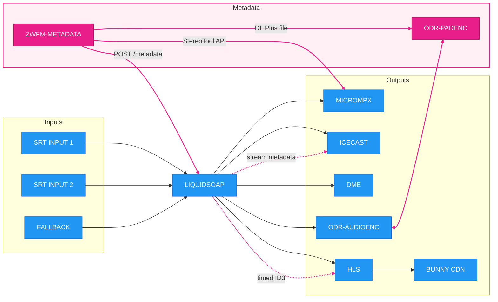

# zwfm-liquidsoap

[](https://github.com/oszuidwest/zwfm-liquidsoap/actions/workflows/ci.yml)
[](https://github.com/oszuidwest/zwfm-liquidsoap/actions/workflows/docker.yml)

A [Liquidsoap](https://www.liquidsoap.info)-based broadcast audio system for [ZuidWest FM](https://www.zuidwestfm.nl/), [Radio Rucphen](https://www.rucphenrtv.nl/), and [BredaNu](https://www.bredanu.nl/).

- Redundant encrypted SRT studio inputs with silence-based failover
- Icecast, HLS, DAB+, and MicroMPX outputs
- Optional StereoTool processing
- Single-container deployment on AMD64 and ARM64


```mermaid
flowchart LR
    subgraph inputs [" Inputs "]
        SRT1["SRT INPUT 1"]
        SRT2["SRT INPUT 2"]
        FALLBACK["FALLBACK"]
    end

    LIQUIDSOAP["LIQUIDSOAP"]

    subgraph outputs [" Outputs "]
        MICROMPX["MICROMPX"]
        ICECAST["ICECAST"]
        DME["DME"]
        HLS["HLS"]
        BUNNY["BUNNY CDN"]
        ODR["ODR-AUDIOENC"]
    end

    subgraph metadata [" Metadata "]
        PADENC["ODR-PADENC"]
        ZWFM["ZWFM-METADATA"]
    end

    SRT1 --> LIQUIDSOAP
    SRT2 --> LIQUIDSOAP
    FALLBACK --> LIQUIDSOAP

    LIQUIDSOAP --> MICROMPX
    LIQUIDSOAP --> ICECAST
    LIQUIDSOAP --> DME
    LIQUIDSOAP --> HLS
    HLS --> BUNNY
    LIQUIDSOAP --> ODR

    ODR <--> PADENC
    ZWFM -->|POST /metadata| LIQUIDSOAP
    ZWFM -->|DL Plus file| PADENC
    ZWFM -->|StereoTool API| MICROMPX
    LIQUIDSOAP -. stream metadata .-> ICECAST
    LIQUIDSOAP -. timed ID3 .-> HLS

    classDef blue fill:#2196F3,stroke:#1565C0,color:#fff
    classDef metadataFlow fill:#E91E8A,stroke:#AD1457,color:#fff

    class SRT1,SRT2,FALLBACK,LIQUIDSOAP,MICROMPX,ICECAST,DME,HLS,BUNNY,ODR blue
    class PADENC,ZWFM metadataFlow
    style metadata fill:#FFF0F6,stroke:#E91E8A,stroke-width:2px
    linkStyle 9,10,11,12,13,14 stroke:#E91E8A,stroke-width:2px
```

Blue paths carry audio. Pink paths carry stream metadata, DAB+ PAD, or StereoTool/RDS metadata; dashed paths are metadata distributed by Liquidsoap.

## Architecture

Liquidsoap selects sources in this order: Studio A, Studio B, emergency audio. A studio becomes unavailable after `SILENCE_SWITCH_SECONDS` of silence or when its SRT connection closes. It must then provide `AUDIO_VALID_SECONDS` of continuous audio before it becomes available again.

`EMERGENCY_AUDIO_PATH` must point to decodable audio. Liquidsoap exits during startup when the file is unusable, unless `EMERGENCY_ALLOW_BLANK=true` explicitly permits a silent fallback for development or tests.

Each station routes audio differently:

| Station       | Icecast, DAB+, and HLS source | Other outputs                                      |
| ------------- | ----------------------------- | -------------------------------------------------- |
| ZuidWest      | Direct studio/fallback audio  | StereoTool generates MicroMPX                      |
| Radio Rucphen | Direct studio/fallback audio  | Two DME Icecast outputs; no StereoTool             |
| BredaNu       | StereoTool-processed audio    | Two DME Icecast outputs; StereoTool emits MicroMPX |

Each Icecast output and DAB+ use a buffered safe source on an independent clock. HLS adds a dedicated clock error handler and restart watchdog, so an optional output failure does not stop the main program audio.

### Components and boundaries

| Component                  | Location            | Responsibility                                                      |
| -------------------------- | ------------------- | ------------------------------------------------------------------- |
| Liquidsoap                 | Main container      | Source selection, silence detection, encoding, APIs, and outputs     |
| StereoTool plugin          | Main container      | BredaNu audio processing and MicroMPX for BredaNu and ZuidWest       |
| ODR-AudioEnc               | Main container      | PCM-to-DAB+ encoding and EDI transport                               |
| DAB TCP ACK monitor        | Main container      | Reads Linux TCP metrics for every AudioEnc TCP destination           |
| Studio SRT encoders        | Studio sites        | Send the redundant encrypted studio feeds                           |
| Icecast and DME            | External services   | Listener streams and Dutch Media Exchange ingestion                  |
| Bunny Storage and CDN      | External services   | Store and distribute the mirrored HLS live window                    |
| ODR-PadEnc                 | External service    | Encodes DAB+ DLS and MOT data for ODR-AudioEnc                       |
| zwfm-metadata              | External service    | Route now-playing data to Liquidsoap, PAD, and StereoTool            |
| MicroMPX receivers         | Transmitter sites   | Decode the FM composite transport generated by StereoTool            |

Icecast, Bunny, DME, ODR-DabMux, PAD, and metadata services are not bundled into the Compose service. The container only includes the producers and clients needed to connect to them.

### Related projects

- [rpi-audio-encoder](https://github.com/oszuidwest/rpi-audio-encoder): SRT studio encoder for Raspberry Pi
- [rpi-umpx-decoder](https://github.com/oszuidwest/rpi-umpx-decoder): MicroMPX receiver for Raspberry Pi
- [ODR-PadEnc](https://github.com/Opendigitalradio/ODR-PadEnc): DAB+ Programme Associated Data encoder
- [zwfm-metadata](https://github.com/oszuidwest/zwfm-metadata): now-playing metadata router

## Installation

### Requirements

- A 64-bit Debian-based host on AMD64 or ARM64; Debian 13 and Ubuntu 24.04 are recommended
- Root access
- Docker with Docker Compose, `curl`, and `dpkg`

The installer adds `socat` and `unzip`, downloads the selected station configuration and fallback audio, installs the StereoTool plugin, and writes the deployment to `/opt/liquidsoap`.

```bash
sudo /bin/bash -c "$(curl -fsSL https://raw.githubusercontent.com/oszuidwest/zwfm-liquidsoap/main/install.sh)"
```

The installer creates `/opt/liquidsoap/.env` from the selected station template. Replace every placeholder before starting the container:

```bash
cd /opt/liquidsoap
nano .env
docker compose up -d
docker compose logs -f
```

Station templates are available for [ZuidWest](.env.zuidwest.example), [Radio Rucphen](.env.rucphen.example), and [BredaNu](.env.bredanu.example). The complete template [.env.example](.env.example) documents the shared options and defaults.

### Deployment layout

The deployment uses the following paths under `/opt/liquidsoap`:

| Path                          | Purpose                                                        |
| ----------------------------- | -------------------------------------------------------------- |
| `.env`                        | Secrets and station configuration                              |
| `docker-compose.yml`          | Container, published ports, mounts, and HLS tmpfs              |
| `scripts/radio.liq`           | Selected station entry point                                   |
| `scripts/lib/`                | Shared source, output, API, and monitoring modules             |
| `audio/fallback.ogg`          | Emergency audio                                                |
| `stereotool/`                 | StereoTool plugin, license state, and processor configuration  |
| `socket/liquidsoap.sock`      | Runtime-control socket                                         |

The HLS working set is not stored in this directory. Compose mounts a 64 MB tmpfs at `/hls` inside the container, so live segments disappear when the container stops and cannot fill the host filesystem.

Common lifecycle commands:

```bash
cd /opt/liquidsoap
docker compose pull
docker compose up -d
docker compose ps
docker compose logs --tail=100 -f
docker compose down
```

`docker compose down` stops the broadcast container. Use it only during an intentional outage; configuration-only changes can normally be applied with `docker compose up -d`.

### Host settings

The installer configures the `Europe/Amsterdam` timezone, time synchronization, and journal limits. It can also set the CPU frequency governor to `performance`. This reduces frequency-scaling delays at the cost of higher power use and heat.

The governor setting is stored in `/etc/tmpfiles.d/cpu-performance.conf` and applied at boot. Verify it with:

```bash
cat /sys/devices/system/cpu/cpufreq/policy*/scaling_governor
```

Remove that file and reboot to restore the host default.

## Configuration

These variables are required for every station:

| Variable                  | Purpose                        |
| ------------------------- | ------------------------------ |
| `STATION_ID`              | Lowercase station identifier   |
| `STATION_NAME`            | Public station name            |
| `ICECAST_HOST`            | Icecast server                 |
| `ICECAST_PORT`            | Icecast source port            |
| `ICECAST_SOURCE_PASSWORD` | Icecast source password        |
| `SRT_PASSPHRASE`          | Studio-input encryption secret |

Optional features are enabled by their credentials or destination settings:

| Feature          | Required variables                                         |
| ---------------- | ---------------------------------------------------------- |
| StereoTool       | `STEREOTOOL_LICENSE` (ZuidWest and BredaNu)                |
| DAB+             | `DAB_BITRATE`, `DAB_EDI_DESTINATIONS`                      |
| HLS              | `HLS_BUNNY_STORAGE_ZONE`, `HLS_BUNNY_ACCESS_KEY`           |
| `GET /status`    | `STATUS_BEARER_TOKEN`                                      |
| `POST /metadata` | `STREAM_METADATA_BEARER_TOKEN`                             |
| DAB+ PAD         | `DAB_METADATA_SOCKET`; `DAB_METADATA_SIZE` defaults to `8` |

Radio Rucphen and BredaNu also require `DME_PRIMARY_HOST`, `DME_PRIMARY_PORT`, `DME_PRIMARY_USER`, `DME_PRIMARY_PASSWORD`, the corresponding `DME_SECONDARY_*` variables, and `DME_MOUNT_POINT`.

Important network defaults:

| Variable              | Default            | Purpose                              |
| --------------------- | ------------------ | ------------------------------------ |
| `SRT_BIND`            | `0.0.0.0`          | Host interface for both SRT ports    |
| `SRT_PORT_PRIMARY`    | `8888`             | Studio A UDP port                    |
| `SRT_PORT_SECONDARY`  | `9999`             | Studio B UDP port                    |
| `HTTP_BIND`           | `127.0.0.1`         | Host interface for the HTTP API      |
| `HTTP_PORT`           | `7000`             | Status and metadata API port         |
| `STEREOTOOL_WEB_BIND` | `0.0.0.0`          | Host interface for the StereoTool UI |
| `STEREOTOOL_WEB_PORT` | `8080`             | StereoTool UI port                   |
| `CONTAINER_TIMEZONE`  | `Europe/Amsterdam` | Container timezone                   |

Keep `HLS_DIR=/hls` with the provided Compose file so HLS uses its isolated tmpfs mount. Keep the default `SERVER_SOCKET_PATH` to expose the control socket through `/opt/liquidsoap/socket` on the host.

### Default stream profiles

Every station publishes three listener or contribution streams to the configured Icecast server:

| Stream ID  | Codec  | Default bitrate | Default mount                    |
| ---------- | ------ | --------------- | -------------------------------- |
| `mp3`      | MP3    | 192 kbps        | `/{ICECAST_MOUNT_BASE}.mp3`      |
| `aac_low`  | AAC-LC | 96 kbps         | `/{ICECAST_MOUNT_BASE}.aac`      |
| `aac_high` | AAC-LC | 576 kbps        | `/{ICECAST_MOUNT_BASE}.stl`      |

`ICECAST_MOUNT_BASE` defaults to `STATION_ID`. Override individual mounts with `ICECAST_MOUNT_MP3`, `ICECAST_MOUNT_AAC_LOW`, and `ICECAST_MOUNT_AAC_HIGH`; override their bitrates with the corresponding `ICECAST_BITRATE_*` variables. Bitrate values are in kbps.

### Failover defaults

| Variable                 | Default               | Purpose                                           |
| ------------------------ | --------------------- | ------------------------------------------------- |
| `EMERGENCY_AUDIO_PATH`   | `/audio/fallback.ogg` | File used when both studio inputs are unavailable |
| `EMERGENCY_ALLOW_BLANK`  | `false`               | Permit silence instead of a valid fallback file   |
| `SILENCE_SWITCH_SECONDS` | `15.0`                | Silence required before removing a studio         |
| `AUDIO_VALID_SECONDS`    | `15.0`                | Continuous audio required before restoring it     |
| `SILENCE_THRESHOLD`      | `-40.0` dB            | Audio below this level is treated as silence      |
| `SERVER_SOCKET_ENABLED`  | `true`                | Enable runtime control                            |

Use `EMERGENCY_ALLOW_BLANK=true` only for development or tests: it explicitly accepts dead air when neither studio is usable.

## Runtime control

The server socket is enabled by default. Connect from the host with:

```bash
socat - UNIX-CONNECT:/opt/liquidsoap/socket/liquidsoap.sock
```

| Command                     | Result                                           |
| --------------------------- | ------------------------------------------------ |
| `radio_prod.status`         | Show automatic/forced mode and the active source |
| `radio_prod.force studio_a` | Select Studio A                                  |
| `radio_prod.force studio_b` | Select Studio B                                  |
| `radio_prod.force fallback` | Select the emergency source                      |
| `radio_prod.auto`           | Restore automatic source selection               |
| `radio_prod.skip`           | Skip the current source                          |
| `studio_a.buffer`           | Show Studio A readiness and buffered seconds     |
| `studio_a.srt`              | Show Studio A SRT connection statistics          |
| `studio_b.buffer`           | Show Studio B readiness and buffered seconds     |
| `studio_b.srt`              | Show Studio B SRT connection statistics          |
| `silence.enable`            | Enable silence-based failover                    |
| `silence.disable`           | Disable silence-based failover                   |
| `silence.status`            | Show the silence-detection state                  |
| `dab.status`                | Show DAB+ TCP acknowledgement health             |
| `hls.status`                | Show local HLS and Bunny mirror health           |

Forcing an unavailable source can take the radio source down. Use `radio_prod.auto` to restore the priority fallback chain.

### Status API

`GET /status` is registered only when `STATUS_BEARER_TOKEN` is set. Use a different token for `POST /metadata`.

```bash
curl --fail-with-body --silent \
  --header "Authorization: Bearer ${STATUS_BEARER_TOKEN}" \
  http://127.0.0.1:7000/status | jq
```

The JSON schema is stable: unavailable scalar values are `null`, collections remain arrays, and error fields contain codes instead of log text.

- `studio_inputs` reports connection state, buffered seconds, stereo RMS and peak levels over 0.5 seconds, and SRT latency, receive-buffer, round-trip, and drop statistics. Its status is `down` when disconnected, `degraded` when silent, `starting` while its buffer fills, and `ok` when ready.
- `outputs.icecast.streams` reports the stable stream ID, host, port, mount, and connection state of every Icecast output.
- `outputs.dab.destinations` reports the TCP state, ACK age, byte counters, send queue, unacknowledged segments, and retransmissions for each configured EDI destination.
- `outputs.hls` reports local writer health and Bunny publication health. The local writer becomes `degraded` with `stalled` after `max(15.0, HLS_SEGMENT_DURATION * 4.0)` seconds without playlist updates: 16 seconds with the defaults. The mirror uses the same threshold for `published_age_seconds`, so even successful uploads report `stalled` if the published audio is too old. A local writer stall also stalls the mirror; if both report `stalled`, start with the writer.

HLS mirror diagnostics describe publication to storage, not delivery through the public CDN:

- `published_age_seconds` is the age, by generation time, of the newest acknowledged segment in the stalest variant playlist. It stays `null` until every variant has an acknowledged, timestamped publication. The static master playlist is excluded.
- `sync_age_seconds` is the age of the oldest worker's last clean pass, including no-op passes; it is not proof of fresh published audio.
- `pending_segments` and `pending_playlists` are sampled from the current local windows, including while uploads run.
- `recovered_uploads` counts successful uploads after earlier failed attempts for the same object name; a playlist may have advanced in the meantime.
- `expired_segments` counts observed, unconfirmed segments that left a worker's live window, including segments blocked behind another failed upload. Expiry means no confirmed upload, not proven remote data loss. Both counters reset when the process restarts.

Possible error codes are:

| Field                                                | Codes                                                                                                                   |
| ---------------------------------------------------- | ----------------------------------------------------------------------------------------------------------------------- |
| `studio_inputs[].error`                              | `disconnected`, `silent`                                                                                                |
| `studio_inputs[].srt.connections[].statistics_error` | `statistics_unavailable`                                                                                                |
| `outputs.dab.error`                                  | `encoder_error` (ODR-AudioEnc crashed in the last 30 seconds), `monitor_failed` (the ACK monitor gave no usable result) |
| `outputs.dab.destinations[].error`                   | `ack_stalled`, `no_socket`, `tcp_not_established`, `invalid_destination`, `monitor_failed`                              |
| `outputs.hls.local.error`                            | `dir_missing`, `dir_not_writable`, `clock_error`, `stalled`                                                             |
| `outputs.hls.mirror.error`                           | `listing_failed`, `upload_failed`, `delete_failed`, `read_failed`, `local_file_missing`, `worker_failed`, `stalled`     |

The top-level status becomes `degraded` when the emergency source is active or an enabled output is unhealthy. It becomes `down` when the radio source is unavailable. HTTP responses use `200` for `ok` and `degraded`, `503` for `down`, and `401` for a missing or invalid token.

## Studio inputs and failover

Silence detection is enabled at startup. Below `SILENCE_THRESHOLD` (default `-40.0` dB), a studio is removed from the fallback chain after `SILENCE_SWITCH_SECONDS` (default `15.0`). It returns after `AUDIO_VALID_SECONDS` (default `15.0`) of continuous audio.

Disabling silence detection bypasses silence stripping: connected studios remain available even when silent, while disconnect-based failover still works. The emergency branch emits silence in this mode.

Each input has a continuously drained 1-second buffer with a 1.25-second maximum. This keeps standby audio current and lets disconnected inputs expire. All SRT callers must use the configured passphrase because the listeners enforce encryption.

Default ports:

- Studio A: UDP `8888`
- Studio B: UDP `9999`

Example sender:

```bash
ffmpeg -f alsa -ac 2 -ar 48000 -i hw:0 \
  -c:a pcm_s16le -vn -f matroska \
  "srt://liquidsoap.example.com:8888?mode=caller&transtype=live&passphrase=your_passphrase"
```

For production studio links, see [rpi-audio-encoder](https://github.com/oszuidwest/rpi-audio-encoder).

## Icecast and DME

The three public Icecast outputs run independently. A failed mount is reported by `GET /status`, but does not stop the other mounts, the source-selection chain, or optional DAB+ and HLS outputs. These public mounts carry the metadata received through `POST /metadata`; the DME ingests ignore it.

Radio Rucphen and BredaNu additionally send the high-bitrate AAC profile to two Dutch Media Exchange ingest points. These are separate Icecast-compatible outputs, not a failover pair managed by Liquidsoap: audio is sent to both continuously, and DME decides how the ingest points are used. Configure both sets of credentials and their shared mount:

```bash
DME_PRIMARY_HOST=ingest1.example.com
DME_PRIMARY_PORT=8000
DME_PRIMARY_USER=station-live
DME_PRIMARY_PASSWORD=replace-me

DME_SECONDARY_HOST=ingest2.example.com
DME_SECONDARY_PORT=8000
DME_SECONDARY_USER=station-live
DME_SECONDARY_PASSWORD=replace-me

DME_MOUNT_POINT=/live
```

Radio Rucphen sends its direct source to DME. BredaNu sends its StereoTool-processed source. DME uses `ICECAST_BITRATE_AAC_HIGH`, so changing that value affects both the `.stl` Icecast mount and both DME outputs.

## StereoTool and MicroMPX

The installer includes the StereoTool plugin, but processing starts only when `STEREOTOOL_LICENSE` is set. ZuidWest uses it only for MicroMPX; BredaNu also sends the processed source to Icecast, DME, DAB+, and HLS. Radio Rucphen does not load StereoTool.

The web interface listens on host port `8080` by default. Set `STEREOTOOL_WEB_BIND=127.0.0.1` unless remote access is required.

## DAB+

`output.external` sends 48 kHz stereo WAV to ODR-AudioEnc, which produces DAB+ EDI. `DAB_BITRATE` is in kbps and must be a multiple of 8 from 8 through 192. Multiple EDI targets are comma-separated:

```bash
DAB_BITRATE=128
DAB_EDI_DESTINATIONS=tcp://primary.example.com:9001,tcp://backup.example.com:9002
DAB_METADATA_SOCKET=padenc.sock
DAB_METADATA_SIZE=8
```

TCP acknowledgement monitoring is enabled by default. It checks Linux TCP metrics for each ODR-AudioEnc destination:

| Status        | Meaning                                                                  |
| ------------- | ------------------------------------------------------------------------ |
| `disabled`    | DAB+ is not configured                                                   |
| `starting`    | All TCP destinations are within their startup grace period               |
| `ok`          | Every TCP destination has recent ACK progress                            |
| `degraded`    | Destinations have mixed health or an ACK warning threshold was exceeded  |
| `down`        | Every TCP destination is down, including when ODR-AudioEnc is not running |
| `unmonitored` | Monitoring is disabled or no TCP destination is configured               |

TCP ACKs confirm receipt by the remote TCP stack, not processing by ODR-DabMux. UDP destinations cannot provide this signal. Tune the monitor with `DAB_ACK_POLL_SECONDS`, `DAB_ACK_WARN_SECONDS`, `DAB_ACK_DOWN_SECONDS`, and `DAB_ACK_STARTUP_GRACE_SECONDS`, or disable it with `DAB_ACK_MONITOR_ENABLED=false`.

`dab.status` renders the same structured state as `GET /status`. Its first line is the overall state, followed by `: <code>` for an aggregate error. Each destination line shows its status, its error code when present, and the counters of a connected socket:

```text
ok
tcp://primary.example.com:9001 ok ack_age=0s bytes_sent=123456 bytes_acked=123457 send_queue=0 unacked=0 retrans=0
```

After an encoder failure, for example, it reports:

```text
down: encoder_error
tcp://primary.example.com:9001 down no_socket
```

### PAD metadata

When `DAB_METADATA_SOCKET` is set, ODR-AudioEnc reads PAD data from the named socket and reserves `DAB_METADATA_SIZE` bytes per audio frame. The default size is 8 bytes; valid values are 0 through 196. A larger value sends slides faster but leaves less capacity for audio at the configured DAB+ bitrate.

ODR-PadEnc runs outside this project and writes PAD data to the configured socket for ODR-AudioEnc. [zwfm-metadata](https://github.com/oszuidwest/zwfm-metadata) generates its ODR-PadEnc-compatible DL Plus file; ODR-PadEnc re-reads that file before each transmission. This route is independent of `POST /metadata`, which does not write DAB PAD.

## Stream metadata

`POST /metadata` inserts now-playing metadata before processing and output fan-out. It updates the public Icecast mounts and adds timed ID3 metadata to HLS. DME ignores the ICY updates; DAB+ PAD and StereoTool/RDS use their own integrations.

The endpoint exists only when `STREAM_METADATA_BEARER_TOKEN` is set:

```bash
curl http://127.0.0.1:7000/metadata \
  --request POST \
  --header "Authorization: Bearer ${STREAM_METADATA_BEARER_TOKEN}" \
  --header "Content-Type: application/json" \
  --data '{"title":"Song title","artist":"Artist name"}'
```

`title` is required and cannot be empty; `artist` is optional. Extra JSON fields are ignored. A valid update returns `204`. Invalid JSON or a missing title returns `400`, an invalid token returns `401`, and a body over 16 KiB or any `Transfer-Encoding` header returns `413`.

One URL output in [zwfm-metadata](https://github.com/oszuidwest/zwfm-metadata) can update all compatible Icecast and HLS outputs:

```json
{
  "type": "url",
  "name": "liquidsoap-stream-metadata",
  "inputs": ["radio-live", "radio-automation", "default-text"],
  "formatters": [],
  "settings": {
    "delay": 0,
    "url": "http://liquidsoap:7000/metadata",
    "method": "POST",
    "bearerToken": "replace-with-the-same-long-random-token"
  }
}
```

Keep the API on a private network. Compose binds it to `127.0.0.1` by default. Containers on the same Docker network can use `http://liquidsoap:7000`; access from another host should use a private network, VPN, or TLS reverse proxy with firewall restrictions.

HLS clients must expose timed ID3 metadata to the player application. hls.js provides `Hls.Events.FRAG_PARSING_METADATA` for this purpose.

## HLS through Bunny CDN

Liquidsoap writes an audio-only live window to a 64 MB tmpfs at `/hls` and mirrors it to Bunny Storage with `http.put` and `http.delete`.

The default ladder contains two AAC-LC MPEG-TS variants:

- 96 kbps: `aac_96.m3u8`
- 192 kbps: `aac_192.m3u8`

`HLS_BITRATE_MID` and `HLS_BITRATE_HIGH` change the encoded bitrates; the playlist names stay fixed. The project pins Liquidsoap 2.4.5 and uses one AAC profile because mixed HE-AAC and AAC-LC variants can drift apart ([Liquidsoap issue #5319](https://github.com/savonet/liquidsoap/issues/5319)).

`live.m3u8` is the main playlist. Defaults are 4-second segments, 10 segments per media playlist, and an `HLS_SEGMENTS_OVERHEAD` of `HLS_SEGMENTS + 3` (13), which keeps 12 removed segments locally for lagging clients. Each variant has an independent mirror worker, so a slow Bunny request cannot starve the other bitrate. A worker reads the newest playlist after every pass and uploads only its referenced segments; obsolete local backlog is skipped. A playlist is uploaded only after all segments it references are present remotely, so failed uploads leave the previous valid playlist online. Remote cleanup runs separately from publication and keeps every segment that is still local, published, or being uploaded, so while the mirror keeps up, a segment stays online for at least one segment plus one playlist duration after it leaves the playlist ([RFC 8216 section 6.2.2](https://www.rfc-editor.org/rfc/rfc8216#section-6.2.2)).

### Bunny setup

1. Create a dedicated Bunny Storage zone and note its read/write password and regional API endpoint.
2. Set `HLS_BUNNY_STORAGE_ZONE`, `HLS_BUNNY_ACCESS_KEY`, and `HLS_BUNNY_ENDPOINT`.
3. Connect the storage zone to a Bunny CDN pull zone and configure its hostname.
4. For cross-origin browser playback, enable CORS for the `m3u8` and `ts` extensions.
5. Set a 1-2 second cache time for `*.m3u8` and a long cache time, such as one day, for `.ts` files.
6. Leave Perma-Cache disabled because live playlists are overwritten in place.

Use a storage zone dedicated to HLS so its password grants access only to live-stream objects.

Player URL:

```text
https://hls.example.com/{STATION_ID}/live.m3u8
```

Validate the public stream and cache headers:

```bash
ffprobe https://hls.example.com/zuidwest/live.m3u8
curl --silent --head https://hls.example.com/zuidwest/live.m3u8
```

Expect two `mp4a.40.2` variants, changing media playlists, no segment `404` responses, and the configured cache lifetimes.

### Failure isolation

- The `/hls` tmpfs prevents host filesystem capacity or permissions from stopping the writer.
- The HLS clock error handler contains write failures.
- The watchdog recreates a failed writer with exponential backoff from 5 seconds to 5 minutes.
- Publication workers retry independently with exponential backoff from 1 second to `max(0.1, min(4.0, HLS_SEGMENT_DURATION))` seconds (also capping the initial delay), re-reading the latest window on each pass. PUT timeouts are `max(0.1, min(10.0, HLS_SEGMENT_DURATION))` seconds: 4 seconds each with the defaults.
- Cleanup keeps its 1-to-30-second retry backoff and 10-second request timeout.
- Failed uploads log their attempt number; recovery and expiry are logged explicitly.
- Mirror errors do not stop the local writer or other outputs.

Use `hls.status` or `outputs.hls` in `GET /status` to inspect writer and publication health together. Slow but successful PUTs can exceed the publication-age threshold; `mirror=stalled` signals stale audio, not necessarily a failed Bunny request. The threshold is deliberately not extended by upload timeouts.

## Troubleshooting

Start with the structured status API and container logs:

```bash
docker compose ps
docker compose logs -f
```

### Repeated source switching

- Check `studio_a.buffer`, `studio_b.buffer`, and the active source.
- Check `studio_a.srt` and `studio_b.srt` for round-trip time and increasing packet drops.
- Adjust `SILENCE_THRESHOLD` or `SILENCE_SWITCH_SECONDS` only when valid audio is being classified as silence.

### Icecast is disconnected

- Check the affected entry in `outputs.icecast.streams`.
- Verify `ICECAST_HOST`, `ICECAST_PORT`, `ICECAST_SOURCE_PASSWORD`, and server reachability.

### HLS is stale or degraded

- Check `hls.status`. `local=<code>` identifies writer or tmpfs failures; `mirror=<code>` identifies publication problems, including stale audio. If both show `stalled`, investigate the writer first; if only the mirror is stalled, inspect upload latency and the pending counts in `GET /status`.
- Verify the Bunny credentials and endpoint.
- Check the pull-zone playlist cache rule and CORS settings.
- Inspect the tmpfs with `docker exec liquidsoap df -h /hls`.

### DAB+ is degraded or down

- Run `dab.status` and inspect each destination's TCP state and ACK age.
- Verify the EDI URL and the warning/down thresholds.
- Check the logs for ODR-AudioEnc restarts or monitor errors.

### StereoTool is not active

- Confirm that the station uses StereoTool and `STEREOTOOL_LICENSE` is set.
- Check the web interface and container logs for license errors.
- On ZuidWest, `stereotool_driver.status` confirms that the MicroMPX branch is being consumed; its Icecast, DAB+, and HLS outputs intentionally bypass StereoTool.

## Development

The Dockerfile pins Liquidsoap 2.4.5. Validate each station entry point with the same image:

```bash
for file in conf/*.liq; do
  docker run --rm -v "$PWD:/app" -w /app \
    savonet/liquidsoap:v2.4.5 liquidsoap -c "$file"
done
```

Run the Liquidsoap and shell tests:

```bash
for test in tests/*.liq; do
  docker run --rm -v "$PWD:/app" -w /app \
    savonet/liquidsoap:v2.4.5 liquidsoap "$test"
done
./tests/test-dab-tcp-ack-monitor.sh
```

Also run `shellcheck install.sh` and, with a configured `.env`, `docker compose config --quiet` when changing shell or deployment files. Format Liquidsoap code with `liquidsoap-prettier -w "**/*.liq"`.

Build a local image:

```bash
docker buildx build --load -t zwfm-liquidsoap:local .
```

The Compose file uses the published GHCR image. Set its `image` to `zwfm-liquidsoap:local` to run the local build. A multi-platform build check does not load an image:

```bash
docker buildx build \
  --platform linux/amd64,linux/arm64 \
  -t zwfm-liquidsoap:local .
```

## License

Copyright 2026 Omroepstichting ZuidWest & Stichting Streekomroep voor de Baronie. Licensed under the [MIT License](LICENSE).

## Acknowledgments

- [Liquidsoap](https://www.liquidsoap.info/)
- [Icecast](https://icecast.org/)
- [StereoTool](https://www.stereotool.com/)
- [Opendigitalradio](https://github.com/Opendigitalradio)
