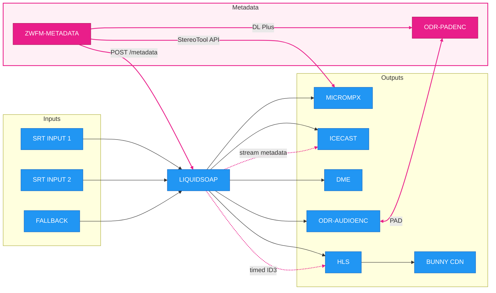

# zwfm-liquidsoap

[](https://github.com/oszuidwest/zwfm-liquidsoap/actions/workflows/ci.yml)
[](https://github.com/oszuidwest/zwfm-liquidsoap/actions/workflows/docker.yml)

A [Liquidsoap](https://www.liquidsoap.info)-based broadcast audio system for [ZuidWest FM](https://www.zuidwestfm.nl/), [Radio Rucphen](https://www.rucphenrtv.nl/), and [BredaNu](https://www.bredanu.nl/).

- Two encrypted SRT studio inputs with automatic failover on silence
- Icecast, HLS, DAB+, and MicroMPX outputs
- Optional StereoTool processing
- One Docker container for AMD64 and ARM64


```mermaid
%%{init: {"layout": "dagre"}}%%
flowchart LR
    subgraph inputs [" Inputs "]
        SRT1["SRT INPUT 1"]
        SRT2["SRT INPUT 2"]
        FALLBACK["FALLBACK"]
    end

    LIQUIDSOAP["LIQUIDSOAP"]

    subgraph outputs [" Outputs "]
        MICROMPX["MICROMPX"]
        ICECAST["ICECAST"]
        DME["DME"]
        ODR["ODR-AUDIOENC"]
        HLS["HLS"]
        BUNNY["BUNNY CDN"]
    end

    subgraph metadata [" Metadata "]
        ZWFM["ZWFM-METADATA"]
        PADENC["ODR-PADENC"]
    end

    %% Audio (links 0-8)
    SRT1 --> LIQUIDSOAP
    SRT2 --> LIQUIDSOAP
    FALLBACK --> LIQUIDSOAP
    LIQUIDSOAP --> MICROMPX
    LIQUIDSOAP --> ICECAST
    LIQUIDSOAP --> DME
    LIQUIDSOAP --> ODR
    LIQUIDSOAP --> HLS
    HLS --> BUNNY

    %% Metadata (links 9-14)
    ZWFM -->|POST /metadata| LIQUIDSOAP
    ZWFM -->|DL Plus| PADENC
    ODR <-->|PAD| PADENC
    ZWFM -->|StereoTool API| MICROMPX
    LIQUIDSOAP -. stream metadata .-> ICECAST
    LIQUIDSOAP -. timed ID3 .-> HLS

    classDef audio fill:#2196F3,stroke:#1565C0,color:#fff
    classDef meta fill:#E91E8A,stroke:#AD1457,color:#fff
    class SRT1,SRT2,FALLBACK,LIQUIDSOAP,MICROMPX,ICECAST,DME,ODR,HLS,BUNNY audio
    class ZWFM,PADENC meta
    style metadata fill:#FFF0F6,stroke:#E91E8A,stroke-width:2px
    linkStyle 9,10,11,12,13,14 stroke:#E91E8A,stroke-width:2px
```

Blue lines carry audio. Pink lines carry now-playing metadata from zwfm-metadata. Dashed lines are metadata that Liquidsoap adds to its own streams.

## Architecture

Liquidsoap selects the source in this order: Studio A, Studio B, emergency audio file. Audio below `SILENCE_THRESHOLD` (default `-40.0` dB) counts as silence. A studio is removed from the chain after `SILENCE_SWITCH_SECONDS` (default `15.0`) of silence, or when its SRT connection closes. It returns after `AUDIO_VALID_SECONDS` (default `15.0`) of continuous audio.

`EMERGENCY_AUDIO_PATH` must point to an audio file that Liquidsoap can decode. If the file is not usable, Liquidsoap stops during startup. Set `EMERGENCY_ALLOW_BLANK=true` to allow silence instead. Use this only for development or tests.

When silence detection is disabled, a silent studio stays available as long as it is connected. Failover on disconnect still works. In this mode, the emergency source outputs silence.

Each station routes audio differently:

| Station       | Source for Icecast, DAB+, and HLS | Other outputs                                      |
| ------------- | --------------------------------- | -------------------------------------------------- |
| ZuidWest      | Studio audio, no StereoTool       | StereoTool generates MicroMPX                      |
| Radio Rucphen | Studio audio, no StereoTool       | Two DME Icecast outputs; no StereoTool             |
| BredaNu       | StereoTool output                 | Two DME Icecast outputs; StereoTool emits MicroMPX |

Each Icecast, DAB+, and HLS output runs on its own clock with a buffered safe source. If an optional output fails, the main program audio continues. Icecast, Bunny, DME, ODR-DabMux, ODR-PadEnc, and zwfm-metadata run outside the container.

### Related projects

- [zwfm-encoder](https://github.com/oszuidwest/zwfm-encoder): SRT studio encoder for Raspberry Pi
- [rpi-umpx-decoder](https://github.com/oszuidwest/rpi-umpx-decoder): MicroMPX receiver for Raspberry Pi
- [zwfm-metadata](https://github.com/oszuidwest/zwfm-metadata): now-playing metadata router
- [zwfm-odrbuilds](https://github.com/oszuidwest/zwfm-odrbuilds): prebuilt ODR-AudioEnc, ODR-PadEnc, and ODR-DabMux binaries used by the Dockerfile

## Installation

Requirements: a 64-bit Debian-based host on AMD64 or ARM64 (Debian 13 or Ubuntu 24.04 recommended), root access, Docker with Docker Compose, `curl`, and `dpkg`.

The installer installs `socat` and `unzip`, downloads the configuration of the selected station and the emergency audio file, installs the StereoTool plugin, and writes everything to `/opt/liquidsoap`:

```bash
sudo /bin/bash -c "$(curl -fsSL https://raw.githubusercontent.com/oszuidwest/zwfm-liquidsoap/main/install.sh)"
```

The installer creates `/opt/liquidsoap/.env` from the template of the selected station. Replace every placeholder before you start the container:

```bash
cd /opt/liquidsoap
nano .env
docker compose up -d
docker compose logs -f
```

`docker compose down` stops the broadcast. Use it only during a planned outage. For configuration changes, `docker compose up -d` is normally enough.

The deployment uses these paths under `/opt/liquidsoap`:

| Path                     | Purpose                                                       |
| ------------------------ | ------------------------------------------------------------- |
| `.env`                   | Secrets and station configuration                             |
| `docker-compose.yml`     | Container, published ports, mounts, and HLS tmpfs             |
| `scripts/radio.liq`      | Entry point of the selected station                           |
| `scripts/lib/`           | Shared source, output, API, and monitoring modules            |
| `audio/fallback.ogg`     | Emergency audio file                                          |
| `stereotool/`            | StereoTool plugin, license state, and processor configuration |
| `socket/liquidsoap.sock` | Control socket                                                |

The installer also sets the timezone to `Europe/Amsterdam`, enables time synchronization, and limits the journal size. It can set the CPU frequency governor to `performance`, stored in `/etc/tmpfiles.d/cpu-performance.conf`. Remove that file and reboot to restore the host default.

## Configuration

[.env.example](.env.example) documents every variable with its default. Station templates: [ZuidWest](.env.zuidwest.example), [Radio Rucphen](.env.rucphen.example), and [BredaNu](.env.bredanu.example).

Every station needs these variables:

| Variable                  | Purpose                                     |
| ------------------------- | ------------------------------------------- |
| `STATION_ID`              | Lowercase station identifier                |
| `STATION_NAME`            | Public station name                         |
| `ICECAST_HOST`            | Icecast server                              |
| `ICECAST_PORT`            | Icecast source port                         |
| `ICECAST_SOURCE_PASSWORD` | Icecast source password                     |
| `SRT_PASSPHRASE`          | Encryption passphrase for the studio inputs |

An optional feature is enabled when its variables are set:

| Feature          | Required variables                                         |
| ---------------- | ---------------------------------------------------------- |
| StereoTool       | `STEREOTOOL_LICENSE` (ZuidWest and BredaNu)                |
| DAB+             | `DAB_BITRATE`, `DAB_EDI_DESTINATIONS`                      |
| DAB+ PAD         | `DAB_METADATA_SOCKET`; `DAB_METADATA_SIZE` defaults to `8` |
| HLS              | `HLS_BUNNY_STORAGE_ZONE`, `HLS_BUNNY_ACCESS_KEY`           |
| `GET /status`    | `STATUS_BEARER_TOKEN`                                      |
| `POST /metadata` | `STREAM_METADATA_BEARER_TOKEN`                             |

Radio Rucphen and BredaNu also need the `DME_PRIMARY_*` and `DME_SECONDARY_*` variables and `DME_MOUNT_POINT`.

Keep `HLS_DIR=/hls` and the default `SERVER_SOCKET_PATH` when you use the provided Compose file. HLS then uses its own tmpfs mount, and the control socket is available at `/opt/liquidsoap/socket` on the host.

## Runtime control

The control socket is enabled by default. Connect from the host with:

```bash
socat - UNIX-CONNECT:/opt/liquidsoap/socket/liquidsoap.sock
```

| Command                     | Result                                                   |
| --------------------------- | -------------------------------------------------------- |
| `radio_prod.status`         | Show the mode (automatic or forced) and the active source |
| `radio_prod.force studio_a` | Select Studio A                                          |
| `radio_prod.force studio_b` | Select Studio B                                          |
| `radio_prod.force fallback` | Select the emergency source                              |
| `radio_prod.auto`           | Restore automatic source selection                       |
| `radio_prod.skip`           | Skip the current source                                  |
| `studio_a.buffer`           | Show Studio A readiness and buffered seconds             |
| `studio_a.srt`              | Show Studio A SRT connection statistics                  |
| `studio_b.buffer`           | Show Studio B readiness and buffered seconds             |
| `studio_b.srt`              | Show Studio B SRT connection statistics                  |
| `silence.enable`            | Enable failover on silence                               |
| `silence.disable`           | Disable failover on silence                              |
| `silence.status`            | Show the silence detection state                         |
| `dab.status`                | Show DAB+ TCP acknowledgement health                     |
| `hls.status`                | Show local HLS and Bunny mirror health                   |

If you force a source that is not available, the radio source can go down. Use `radio_prod.auto` to restore automatic selection.

## HTTP API

Keep the API on a private network. Compose binds it to `127.0.0.1` by default. Containers on the same Docker network can use `http://liquidsoap:7000`.

### GET /status

`GET /status` returns the runtime state as JSON. It is registered only when `STATUS_BEARER_TOKEN` is set.

```bash
curl --fail-with-body --silent \
  --header "Authorization: Bearer ${STATUS_BEARER_TOKEN}" \
  http://127.0.0.1:7000/status | jq
```

The top-level status is `ok`, `degraded` (the emergency source is active or an enabled output is unhealthy), or `down` (no radio source). The HTTP response code is `200` for `ok` and `degraded`, `503` for `down`, and `401` for a missing or invalid token. All fields, status values, and error codes are described in [docs/status-api.md](docs/status-api.md).

### POST /metadata

`POST /metadata` inserts now-playing metadata before processing and before the outputs. It updates the public Icecast mounts and adds timed ID3 metadata to HLS. DME ignores these ICY updates. DAB+ PAD and StereoTool RDS have their own integrations. The endpoint is registered only when `STREAM_METADATA_BEARER_TOKEN` is set. Use a different token than for `GET /status`.

```bash
curl http://127.0.0.1:7000/metadata \
  --request POST \
  --header "Authorization: Bearer ${STREAM_METADATA_BEARER_TOKEN}" \
  --header "Content-Type: application/json" \
  --data '{"title":"Song title","artist":"Artist name"}'
```

`title` is required and cannot be empty. `artist` is optional. Extra JSON fields are ignored. A valid update returns `204`. Invalid JSON or a missing title returns `400`. An invalid token returns `401`. A body over 16 KiB or any `Transfer-Encoding` header returns `413`. [zwfm-metadata](https://github.com/oszuidwest/zwfm-metadata) can call this endpoint with a URL output.

## Studio inputs

Studio A listens on UDP `8888` and Studio B on UDP `9999` (`SRT_PORT_PRIMARY` and `SRT_PORT_SECONDARY`). The listeners enforce encryption, so every SRT caller must use `SRT_PASSPHRASE`. Each input has a 1-second buffer with a 1.25-second maximum. For the studio side, see [zwfm-encoder](https://github.com/oszuidwest/zwfm-encoder).

## Icecast and DME

Every station sends an MP3 stream and two AAC-LC streams to the configured Icecast server. The three outputs run independently. When one mount fails, `GET /status` reports it and the other outputs continue.

Radio Rucphen and BredaNu also send the high-bitrate AAC stream to two Dutch Media Exchange ingest points. These are two separate Icecast-compatible outputs. Liquidsoap sends audio to both at the same time, and DME decides how it uses them. Radio Rucphen sends the studio audio to DME without StereoTool. BredaNu sends its StereoTool output. DME uses `ICECAST_BITRATE_AAC_HIGH`, so changing that value also changes the `.stl` Icecast mount.

## StereoTool and MicroMPX

The installer includes the StereoTool plugin. Processing starts only when `STEREOTOOL_LICENSE` is set. ZuidWest uses StereoTool only for MicroMPX. BredaNu also sends the StereoTool output to Icecast, DME, DAB+, and HLS. Radio Rucphen does not load StereoTool.

The web interface listens on host port `8080` by default. Set `STEREOTOOL_WEB_BIND=127.0.0.1` unless you need remote access.

## DAB+

`output.external` sends 48 kHz stereo WAV to ODR-AudioEnc, which produces DAB+ EDI. `DAB_BITRATE` is in kbps and must be a multiple of 8, from 8 to 192. Separate multiple EDI destinations with commas.

A monitor checks the TCP acknowledgements of each `tcp://` destination and reports them in `GET /status` and `dab.status`. A TCP ACK shows that the remote TCP stack received the data. It does not show that ODR-DabMux processed the data. The status values and error codes are described in [docs/status-api.md](docs/status-api.md#outputsdab).

When `DAB_METADATA_SOCKET` is set, ODR-AudioEnc reads PAD data from that socket and reserves `DAB_METADATA_SIZE` bytes per audio frame (default 8, valid 0 to 196). A larger value sends slides faster, but leaves less room for audio. ODR-PadEnc runs outside this project and writes the PAD data to that socket. zwfm-metadata sends DL Plus data directly to ODR-PadEnc. `POST /metadata` does not write DAB PAD.

## HLS through Bunny CDN

Liquidsoap writes an audio-only live window with three MPEG-TS variants (48 kbps HE-AAC, 96 kbps AAC-LC, and 192 kbps AAC-LC) to a tmpfs at `/hls` and mirrors it to Bunny Storage. A Bunny CDN pull zone serves the stream from:

```text
https://hls.example.com/{STATION_ID}/live.m3u8
```

HLS failures do not stop the other outputs. The writer, the mirror, the Bunny setup, and the health values are described in [docs/hls-operations.md](docs/hls-operations.md).

## Troubleshooting

Start with `GET /status` and `docker compose logs -f`.

- If the source switches repeatedly, check `studio_a.srt` and `studio_b.srt` for round-trip time and packet drops. Change `SILENCE_THRESHOLD` or `SILENCE_SWITCH_SECONDS` only when valid audio is detected as silence.
- If an Icecast mount is disconnected, check `outputs.icecast.streams`, the Icecast credentials, and whether the server is reachable.
- If DAB+ is degraded or down, run `dab.status` and check the TCP state and ACK age of each destination. Check the logs for ODR-AudioEnc restarts.
- If HLS is stale or degraded, run `hls.status` and follow [docs/hls-operations.md](docs/hls-operations.md#troubleshooting).
- If StereoTool is not active, check that the station uses StereoTool and that `STEREOTOOL_LICENSE` is set. Check the web interface for license errors.

## Development

The Dockerfile pins the Liquidsoap version. Check each station entry point with the same image:

```bash
for file in conf/*.liq; do
  docker run --rm -v "$PWD:/app" -w /app \
    "ghcr.io/savonet/liquidsoap:v$(grep "^ARG LIQUIDSOAP_VERSION" Dockerfile | cut -d= -f2)" liquidsoap -c "$file"
done
```

Run the Liquidsoap and shell tests:

```bash
for test in tests/*.liq; do
  docker run --rm -v "$PWD:/app" -w /app \
    "ghcr.io/savonet/liquidsoap:v$(grep "^ARG LIQUIDSOAP_VERSION" Dockerfile | cut -d= -f2)" liquidsoap "$test"
done
./tests/test-dab-tcp-ack-monitor.sh
```

When you change shell or deployment files, also run `shellcheck install.sh` and `docker compose config --quiet`. Format Liquidsoap code with `liquidsoap-prettier -w "**/*.liq"`.

Build a local image with `docker buildx build --load -t zwfm-liquidsoap:local .` and set `image` in the Compose file to `zwfm-liquidsoap:local` to run it.

## License

Copyright 2026 Omroepstichting ZuidWest & Stichting Streekomroep voor de Baronie. Licensed under the [MIT License](LICENSE).

## Acknowledgments

- [Liquidsoap](https://www.liquidsoap.info/)
- [Icecast](https://icecast.org/)
- [StereoTool](https://www.stereotool.com/)
- [Opendigitalradio](https://github.com/Opendigitalradio)
