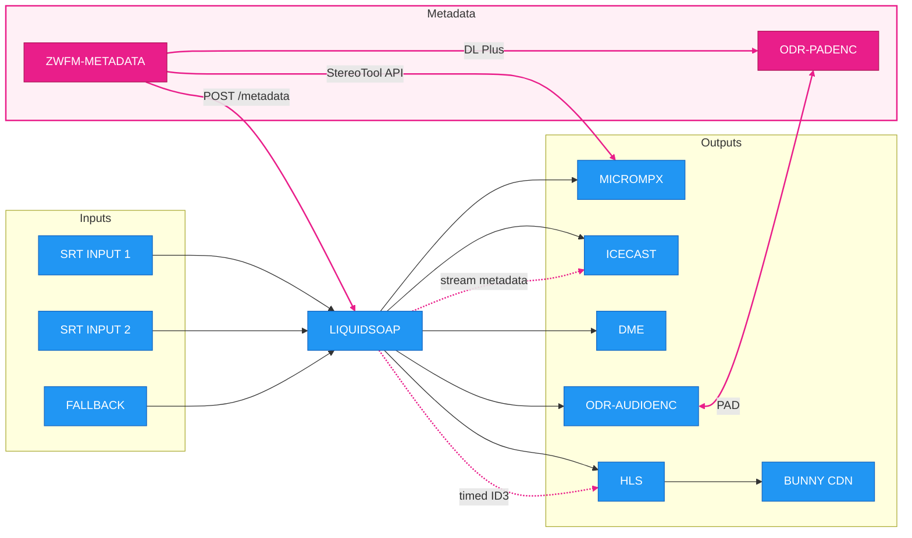

# zwfm-liquidsoap

[](https://github.com/oszuidwest/zwfm-liquidsoap/actions/workflows/ci.yml)
[](https://github.com/oszuidwest/zwfm-liquidsoap/actions/workflows/docker.yml)

A [Liquidsoap](https://www.liquidsoap.info)-based broadcast audio system for [ZuidWest FM](https://www.zuidwestfm.nl/), [Radio Rucphen](https://www.rucphenrtv.nl/), and [BredaNu](https://www.bredanu.nl/).

- Two encrypted SRT studio inputs with automatic failover on silence
- Icecast, HLS, DAB+, and MicroMPX outputs
- Optional StereoTool processing
- One Docker container for AMD64 and ARM64


```mermaid
%%{init: {"layout": "dagre"}}%%
flowchart LR
    subgraph inputs [" Inputs "]
        SRT1["SRT INPUT 1"]
        SRT2["SRT INPUT 2"]
        FALLBACK["FALLBACK"]
    end

    LIQUIDSOAP["LIQUIDSOAP"]

    subgraph outputs [" Outputs "]
        MICROMPX["MICROMPX"]
        ICECAST["ICECAST"]
        DME["DME"]
        ODR["ODR-AUDIOENC"]
        HLS["HLS"]
        BUNNY["BUNNY CDN"]
    end

    subgraph metadata [" Metadata "]
        ZWFM["ZWFM-METADATA"]
        PADENC["ODR-PADENC"]
    end

    %% Audio (links 0-8)
    SRT1 --> LIQUIDSOAP
    SRT2 --> LIQUIDSOAP
    FALLBACK --> LIQUIDSOAP
    LIQUIDSOAP --> MICROMPX
    LIQUIDSOAP --> ICECAST
    LIQUIDSOAP --> DME
    LIQUIDSOAP --> ODR
    LIQUIDSOAP --> HLS
    HLS --> BUNNY

    %% Metadata (links 9-14)
    ZWFM -->|POST /metadata| LIQUIDSOAP
    ZWFM -->|DL Plus| PADENC
    ODR <-->|PAD| PADENC
    ZWFM -->|StereoTool API| MICROMPX
    LIQUIDSOAP -. stream metadata .-> ICECAST
    LIQUIDSOAP -. timed ID3 .-> HLS

    classDef audio fill:#2196F3,stroke:#1565C0,color:#fff
    classDef meta fill:#E91E8A,stroke:#AD1457,color:#fff
    class SRT1,SRT2,FALLBACK,LIQUIDSOAP,MICROMPX,ICECAST,DME,ODR,HLS,BUNNY audio
    class ZWFM,PADENC meta
    style metadata fill:#FFF0F6,stroke:#E91E8A,stroke-width:2px
    linkStyle 9,10,11,12,13,14 stroke:#E91E8A,stroke-width:2px
```

Blue lines carry audio. Pink lines carry now-playing metadata from zwfm-metadata. Dashed lines are metadata that Liquidsoap adds to its own streams.

## Architecture

Liquidsoap selects the source in this order: Studio A, Studio B, emergency audio file. A studio becomes unavailable after `SILENCE_SWITCH_SECONDS` of silence, or when its SRT connection closes. The studio becomes available again after `AUDIO_VALID_SECONDS` of continuous audio.

`EMERGENCY_AUDIO_PATH` must point to an audio file that Liquidsoap can decode. If the file is not usable, Liquidsoap stops during startup. Set `EMERGENCY_ALLOW_BLANK=true` to allow silence instead. Use this only for development or tests.

Each station routes audio differently:

| Station       | Source for Icecast, DAB+, and HLS | Other outputs                                      |
| ------------- | --------------------------------- | -------------------------------------------------- |
| ZuidWest      | Unprocessed audio                 | StereoTool generates MicroMPX                      |
| Radio Rucphen | Unprocessed audio                 | Two DME Icecast outputs; no StereoTool             |
| BredaNu       | StereoTool output                 | Two DME Icecast outputs; StereoTool emits MicroMPX |

Each Icecast output and the DAB+ output use a buffered safe source on its own clock. HLS also has a clock error handler and a restart watchdog. If an optional output fails, the main program audio continues.

### Components and boundaries

| Component             | Location          | Responsibility                                                    |
| --------------------- | ----------------- | ----------------------------------------------------------------- |
| Liquidsoap            | Main container    | Source selection, silence detection, encoding, APIs, and outputs  |
| StereoTool plugin     | Main container    | Audio processing for BredaNu; MicroMPX for BredaNu and ZuidWest   |
| ODR-AudioEnc          | Main container    | DAB+ encoding and EDI transport                                   |
| DAB TCP ACK monitor   | Main container    | Reads Linux TCP metrics for each AudioEnc TCP destination         |
| Studio SRT encoders   | Studio sites      | Send the two encrypted studio feeds                               |
| Icecast and DME       | External services | Listener streams and Dutch Media Exchange ingest                  |
| Bunny Storage and CDN | External services | Store and serve the mirrored HLS live window                      |
| ODR-PadEnc            | External service  | Encodes DAB+ DLS and MOT data for ODR-AudioEnc                    |
| zwfm-metadata         | External service  | Sends now-playing data to Liquidsoap, ODR-PadEnc, and StereoTool  |
| MicroMPX receivers    | Transmitter sites | Decode the FM composite signal from StereoTool                    |

Icecast, Bunny, DME, ODR-DabMux, ODR-PadEnc, and zwfm-metadata are not part of the Compose service. The container only includes the encoders and clients that connect to them.

### Related projects

- [rpi-audio-encoder](https://github.com/oszuidwest/rpi-audio-encoder): SRT studio encoder for Raspberry Pi
- [rpi-umpx-decoder](https://github.com/oszuidwest/rpi-umpx-decoder): MicroMPX receiver for Raspberry Pi
- [zwfm-metadata](https://github.com/oszuidwest/zwfm-metadata): now-playing metadata router
- [ODR-PadEnc](https://github.com/Opendigitalradio/ODR-PadEnc): DAB+ Programme Associated Data encoder

## Installation

### Requirements

- A 64-bit Debian-based host on AMD64 or ARM64. Debian 13 and Ubuntu 24.04 are recommended.
- Root access
- Docker with Docker Compose, `curl`, and `dpkg`

The installer installs `socat` and `unzip`. It downloads the configuration of the selected station and the emergency audio file. It installs the StereoTool plugin and writes everything to `/opt/liquidsoap`.

```bash
sudo /bin/bash -c "$(curl -fsSL https://raw.githubusercontent.com/oszuidwest/zwfm-liquidsoap/main/install.sh)"
```

The installer creates `/opt/liquidsoap/.env` from the template of the selected station. Replace every placeholder before you start the container:

```bash
cd /opt/liquidsoap
nano .env
docker compose up -d
docker compose logs -f
```

There are templates for [ZuidWest](.env.zuidwest.example), [Radio Rucphen](.env.rucphen.example), and [BredaNu](.env.bredanu.example). The full template [.env.example](.env.example) lists all shared options and their defaults.

### Deployment layout

The deployment uses these paths under `/opt/liquidsoap`:

| Path                     | Purpose                                                       |
| ------------------------ | ------------------------------------------------------------- |
| `.env`                   | Secrets and station configuration                             |
| `docker-compose.yml`     | Container, published ports, mounts, and HLS tmpfs             |
| `scripts/radio.liq`      | Entry point of the selected station                           |
| `scripts/lib/`           | Shared source, output, API, and monitoring modules            |
| `audio/fallback.ogg`     | Emergency audio file                                          |
| `stereotool/`            | StereoTool plugin, license state, and processor configuration |
| `socket/liquidsoap.sock` | Control socket                                                |

The HLS files are not in this directory. Compose mounts a 64 MB tmpfs at `/hls` in the container. The live segments disappear when the container stops, and they cannot fill the host filesystem.

Common commands:

```bash
cd /opt/liquidsoap
docker compose pull
docker compose up -d
docker compose ps
docker compose logs --tail=100 -f
docker compose down
```

`docker compose down` stops the broadcast. Use it only during a planned outage. For configuration changes, `docker compose up -d` is normally enough.

### Host settings

The installer sets the timezone to `Europe/Amsterdam`, enables time synchronization, and limits the journal size. It can also set the CPU frequency governor to `performance`. This removes frequency-scaling delays. It also increases power use and heat.

The governor setting is stored in `/etc/tmpfiles.d/cpu-performance.conf` and applied at boot. Check it with:

```bash
cat /sys/devices/system/cpu/cpufreq/policy*/scaling_governor
```

To restore the host default, remove that file and reboot.

## Configuration

Every station needs these variables:

| Variable                  | Purpose                              |
| ------------------------- | ------------------------------------ |
| `STATION_ID`              | Lowercase station identifier         |
| `STATION_NAME`            | Public station name                  |
| `ICECAST_HOST`            | Icecast server                       |
| `ICECAST_PORT`            | Icecast source port                  |
| `ICECAST_SOURCE_PASSWORD` | Icecast source password              |
| `SRT_PASSPHRASE`          | Encryption passphrase for the studio inputs |

An optional feature is enabled when its variables are set:

| Feature          | Required variables                                         |
| ---------------- | ---------------------------------------------------------- |
| StereoTool       | `STEREOTOOL_LICENSE` (ZuidWest and BredaNu)                |
| DAB+             | `DAB_BITRATE`, `DAB_EDI_DESTINATIONS`                      |
| HLS              | `HLS_BUNNY_STORAGE_ZONE`, `HLS_BUNNY_ACCESS_KEY`           |
| `GET /status`    | `STATUS_BEARER_TOKEN`                                      |
| `POST /metadata` | `STREAM_METADATA_BEARER_TOKEN`                             |
| DAB+ PAD         | `DAB_METADATA_SOCKET`; `DAB_METADATA_SIZE` defaults to `8` |

Radio Rucphen and BredaNu also need `DME_PRIMARY_HOST`, `DME_PRIMARY_PORT`, `DME_PRIMARY_USER`, `DME_PRIMARY_PASSWORD`, the matching `DME_SECONDARY_*` variables, and `DME_MOUNT_POINT`.

Network defaults:

| Variable              | Default            | Purpose                              |
| --------------------- | ------------------ | ------------------------------------ |
| `SRT_BIND`            | `0.0.0.0`          | Host interface for both SRT ports    |
| `SRT_PORT_PRIMARY`    | `8888`             | Studio A UDP port                    |
| `SRT_PORT_SECONDARY`  | `9999`             | Studio B UDP port                    |
| `HTTP_BIND`           | `127.0.0.1`        | Host interface for the HTTP API      |
| `HTTP_PORT`           | `7000`             | Status and metadata API port         |
| `STEREOTOOL_WEB_BIND` | `0.0.0.0`          | Host interface for the StereoTool UI |
| `STEREOTOOL_WEB_PORT` | `8080`             | StereoTool UI port                   |
| `CONTAINER_TIMEZONE`  | `Europe/Amsterdam` | Container timezone                   |

Keep `HLS_DIR=/hls` when you use the provided Compose file. HLS then uses its own tmpfs mount. Keep the default `SERVER_SOCKET_PATH`. The control socket is then available at `/opt/liquidsoap/socket` on the host.

### Default stream profiles

Every station sends three streams to the configured Icecast server:

| Stream ID  | Codec  | Default bitrate | Default mount               |
| ---------- | ------ | --------------- | --------------------------- |
| `mp3`      | MP3    | 192 kbps        | `/{ICECAST_MOUNT_BASE}.mp3` |
| `aac_low`  | AAC-LC | 96 kbps         | `/{ICECAST_MOUNT_BASE}.aac` |
| `aac_high` | AAC-LC | 576 kbps        | `/{ICECAST_MOUNT_BASE}.stl` |

`ICECAST_MOUNT_BASE` defaults to `STATION_ID`. Set `ICECAST_MOUNT_MP3`, `ICECAST_MOUNT_AAC_LOW`, or `ICECAST_MOUNT_AAC_HIGH` to change one mount. Set the matching `ICECAST_BITRATE_*` variable to change a bitrate. Bitrates are in kbps.

### Failover defaults

| Variable                 | Default               | Purpose                                            |
| ------------------------ | --------------------- | -------------------------------------------------- |
| `EMERGENCY_AUDIO_PATH`   | `/audio/fallback.ogg` | File used when both studio inputs are unavailable  |
| `EMERGENCY_ALLOW_BLANK`  | `false`               | Allow silence instead of a valid emergency file    |
| `SILENCE_SWITCH_SECONDS` | `15.0`                | Seconds of silence before a studio is removed      |
| `AUDIO_VALID_SECONDS`    | `15.0`                | Seconds of audio before a studio is restored       |
| `SILENCE_THRESHOLD`      | `-40.0` dB            | Audio below this level counts as silence           |
| `SERVER_SOCKET_ENABLED`  | `true`                | Enable the control socket                          |

Set `EMERGENCY_ALLOW_BLANK=true` only for development or tests. It allows dead air when neither studio is usable.

## Runtime control

The control socket is enabled by default. Connect from the host with:

```bash
socat - UNIX-CONNECT:/opt/liquidsoap/socket/liquidsoap.sock
```

| Command                     | Result                                                   |
| --------------------------- | -------------------------------------------------------- |
| `radio_prod.status`         | Show the mode (automatic or forced) and the active source |
| `radio_prod.force studio_a` | Select Studio A                                          |
| `radio_prod.force studio_b` | Select Studio B                                          |
| `radio_prod.force fallback` | Select the emergency source                              |
| `radio_prod.auto`           | Restore automatic source selection                       |
| `radio_prod.skip`           | Skip the current source                                  |
| `studio_a.buffer`           | Show Studio A readiness and buffered seconds             |
| `studio_a.srt`              | Show Studio A SRT connection statistics                  |
| `studio_b.buffer`           | Show Studio B readiness and buffered seconds             |
| `studio_b.srt`              | Show Studio B SRT connection statistics                  |
| `silence.enable`            | Enable failover on silence                               |
| `silence.disable`           | Disable failover on silence                              |
| `silence.status`            | Show the silence detection state                         |
| `dab.status`                | Show DAB+ TCP acknowledgement health                     |
| `hls.status`                | Show local HLS and Bunny mirror health                   |

If you force a source that is not available, the radio source can go down. Use `radio_prod.auto` to restore automatic selection.

### Status API

`GET /status` is only registered when `STATUS_BEARER_TOKEN` is set. Use a different token for `POST /metadata`.

```bash
curl --fail-with-body --silent \
  --header "Authorization: Bearer ${STATUS_BEARER_TOKEN}" \
  http://127.0.0.1:7000/status | jq
```

The JSON schema is stable. Unavailable scalar values are `null`. Collections are always arrays. Error fields contain error codes.

- `studio_inputs` reports the connection state, the buffered seconds, and the stereo RMS and peak levels over 0.5 seconds. It also reports the SRT latency, receive buffer, round-trip time, and drop statistics. The status is `down` when the input is disconnected, `degraded` when it is silent, `starting` while its buffer fills, and `ok` when it is ready.
- `outputs.icecast.streams` reports the stream ID, host, port, mount, and connection state of each Icecast output.
- `outputs.dab.destinations` reports the TCP state, ACK age, byte counters, send queue, unacknowledged segments, and retransmissions of each EDI destination.
- `outputs.hls` reports the health of the local writer and of the Bunny mirror. The local writer becomes `degraded` with error `stalled` when the playlist is not updated for `max(15.0, HLS_SEGMENT_DURATION * 4.0)` seconds. With the defaults, this is 16 seconds. The mirror uses the same threshold for `published_age_seconds`. Uploads can succeed and the mirror can still report `stalled` when the published audio is too old. When the local writer stalls, the mirror also stalls. If both report `stalled`, check the writer first.

The HLS mirror values describe the upload to Bunny Storage. They do not describe delivery through the public CDN:

- `published_age_seconds` is the age of the newest acknowledged segment of the variant that is furthest behind. The age is measured from the generation time of the segment. The value is `null` until every variant has an acknowledged publication with a timestamp. The static master playlist is not counted.
- `pending_segments` and `pending_playlists` are counted from the current local windows. Uploads that are running are included.
- `recovered_uploads` counts uploads that succeeded after one or more failed attempts for the same object name. The playlist may have moved on in the meantime.
- `expired_segments` counts segments that left the live window of a worker without a confirmed upload. This includes segments that were blocked behind another failed upload. An expired segment has no confirmed upload. It is not proof that data is missing on the remote side. Both counters reset when the process restarts.

Possible error codes:

| Field                                                | Codes                                                                                                                   |
| ---------------------------------------------------- | ----------------------------------------------------------------------------------------------------------------------- |
| `studio_inputs[].error`                              | `disconnected`, `silent`                                                                                                |
| `studio_inputs[].srt.connections[].statistics_error` | `statistics_unavailable`                                                                                                |
| `outputs.dab.error`                                  | `encoder_error` (ODR-AudioEnc crashed in the last 30 seconds), `monitor_failed` (the ACK monitor gave no usable result) |
| `outputs.dab.destinations[].error`                   | `ack_stalled`, `no_socket`, `tcp_not_established`, `invalid_destination`, `monitor_failed`                              |
| `outputs.hls.local.error`                            | `dir_missing`, `dir_not_writable`, `clock_error`, `stalled`                                                             |
| `outputs.hls.mirror.error`                           | `listing_failed`, `upload_failed`, `delete_failed`, `read_failed`, `local_file_missing`, `worker_failed`, `stalled`     |

The top-level status is `degraded` when the emergency source is active or when an enabled output is unhealthy. It is `down` when the radio source is unavailable. The HTTP response code is `200` for `ok` and `degraded`, `503` for `down`, and `401` for a missing or invalid token.

## Studio inputs and failover

Silence detection is enabled at startup. Audio below `SILENCE_THRESHOLD` (default `-40.0` dB) counts as silence. A studio is removed from the fallback chain after `SILENCE_SWITCH_SECONDS` (default `15.0`) of silence. It returns after `AUDIO_VALID_SECONDS` (default `15.0`) of continuous audio.

When silence detection is disabled, a silent studio stays available as long as it is connected. Failover on disconnect still works. In this mode, the emergency branch outputs silence.

Each input has a 1-second buffer that is drained continuously. The buffer holds at most 1.25 seconds. This keeps standby audio current and lets disconnected inputs expire. The listeners enforce encryption, so every SRT caller must use the configured passphrase.

Default ports:

- Studio A: UDP `8888`
- Studio B: UDP `9999`

Example sender:

```bash
ffmpeg -f alsa -ac 2 -ar 48000 -i hw:0 \
  -c:a pcm_s16le -vn -f matroska \
  "srt://liquidsoap.example.com:8888?mode=caller&transtype=live&passphrase=your_passphrase"
```

For production studio links, see [rpi-audio-encoder](https://github.com/oszuidwest/rpi-audio-encoder).

## Icecast and DME

The three public Icecast outputs run independently. When one mount fails, `GET /status` reports it. The other mounts, the source selection, and the DAB+ and HLS outputs continue. The public mounts carry the metadata from `POST /metadata`. The DME outputs do not carry it.

Radio Rucphen and BredaNu also send the high-bitrate AAC stream to two Dutch Media Exchange ingest points. These are two separate Icecast-compatible outputs. Liquidsoap sends audio to both at the same time. DME decides how it uses the two ingest points. Configure both sets of credentials and the shared mount:

```bash
DME_PRIMARY_HOST=ingest1.example.com
DME_PRIMARY_PORT=8000
DME_PRIMARY_USER=station-live
DME_PRIMARY_PASSWORD=replace-me

DME_SECONDARY_HOST=ingest2.example.com
DME_SECONDARY_PORT=8000
DME_SECONDARY_USER=station-live
DME_SECONDARY_PASSWORD=replace-me

DME_MOUNT_POINT=/live
```

Radio Rucphen sends its unprocessed source to DME. BredaNu sends its StereoTool output. DME uses `ICECAST_BITRATE_AAC_HIGH`. When you change that value, the `.stl` Icecast mount and both DME outputs change.

## StereoTool and MicroMPX

The installer includes the StereoTool plugin. Processing starts only when `STEREOTOOL_LICENSE` is set. ZuidWest uses StereoTool only for MicroMPX. BredaNu also sends the StereoTool output to Icecast, DME, DAB+, and HLS. Radio Rucphen does not load StereoTool.

The web interface listens on host port `8080` by default. Set `STEREOTOOL_WEB_BIND=127.0.0.1` unless you need remote access.

## DAB+

`output.external` sends 48 kHz stereo WAV to ODR-AudioEnc. ODR-AudioEnc produces DAB+ EDI. `DAB_BITRATE` is in kbps. It must be a multiple of 8, from 8 to 192. Separate multiple EDI destinations with commas:

```bash
DAB_BITRATE=128
DAB_EDI_DESTINATIONS=tcp://primary.example.com:9001,tcp://backup.example.com:9002
DAB_METADATA_SOCKET=padenc.sock
DAB_METADATA_SIZE=8
```

TCP acknowledgement monitoring is enabled by default. The monitor reads the Linux TCP metrics of each ODR-AudioEnc destination:

| Status        | Meaning                                                                    |
| ------------- | -------------------------------------------------------------------------- |
| `disabled`    | DAB+ is not configured                                                     |
| `starting`    | All TCP destinations are in their startup grace period                     |
| `ok`          | Every TCP destination has recent ACK progress                              |
| `degraded`    | Destinations have mixed health, or an ACK warning threshold was exceeded   |
| `down`        | Every TCP destination is down. This includes ODR-AudioEnc not running      |
| `unmonitored` | Monitoring is disabled, or no TCP destination is configured                |

A TCP ACK shows that the remote TCP stack received the data. It does not show that ODR-DabMux processed the data. UDP destinations give no ACK signal. Tune the monitor with `DAB_ACK_POLL_SECONDS`, `DAB_ACK_WARN_SECONDS`, `DAB_ACK_DOWN_SECONDS`, and `DAB_ACK_STARTUP_GRACE_SECONDS`. Set `DAB_ACK_MONITOR_ENABLED=false` to disable it.

`dab.status` shows the same state as `GET /status`. The first line is the overall state. When there is an aggregate error, the line ends with `: <code>`. Each destination line shows the status, the error code if there is one, and the counters of a connected socket:

```text
ok
tcp://primary.example.com:9001 ok ack_age=0s bytes_sent=123456 bytes_acked=123457 send_queue=0 unacked=0 retrans=0
```

After an encoder failure, for example, it shows:

```text
down: encoder_error
tcp://primary.example.com:9001 down no_socket
```

### PAD metadata

When `DAB_METADATA_SOCKET` is set, ODR-AudioEnc reads PAD data from that socket. It reserves `DAB_METADATA_SIZE` bytes per audio frame. The default is 8 bytes. Valid values are 0 to 196. A larger value sends slides faster, but leaves less room for audio at the configured DAB+ bitrate.

ODR-PadEnc runs outside this project. It writes the PAD data to the socket for ODR-AudioEnc. [zwfm-metadata](https://github.com/oszuidwest/zwfm-metadata) sends DL Plus data directly to ODR-PadEnc. `POST /metadata` does not write DAB PAD.

## Stream metadata

`POST /metadata` inserts now-playing metadata before processing and before the outputs. It updates the public Icecast mounts and adds timed ID3 metadata to HLS. DME does not use the ICY updates. DAB+ PAD and StereoTool RDS have their own integrations.

The endpoint only exists when `STREAM_METADATA_BEARER_TOKEN` is set:

```bash
curl http://127.0.0.1:7000/metadata \
  --request POST \
  --header "Authorization: Bearer ${STREAM_METADATA_BEARER_TOKEN}" \
  --header "Content-Type: application/json" \
  --data '{"title":"Song title","artist":"Artist name"}'
```

`title` is required and cannot be empty. `artist` is optional. Extra JSON fields are ignored. A valid update returns `204`. Invalid JSON or a missing title returns `400`. An invalid token returns `401`. A body over 16 KiB or any `Transfer-Encoding` header returns `413`.

One URL output in [zwfm-metadata](https://github.com/oszuidwest/zwfm-metadata) can update all Icecast and HLS outputs:

```json
{
  "type": "url",
  "name": "liquidsoap-stream-metadata",
  "inputs": ["radio-live", "radio-automation", "default-text"],
  "formatters": [],
  "settings": {
    "delay": 0,
    "url": "http://liquidsoap:7000/metadata",
    "method": "POST",
    "bearerToken": "replace-with-the-same-long-random-token"
  }
}
```

Keep the API on a private network. Compose binds it to `127.0.0.1` by default. Containers on the same Docker network can use `http://liquidsoap:7000`. For access from another host, use a private network, a VPN, or a TLS reverse proxy with firewall rules.

HLS clients must pass timed ID3 metadata to the player application. In hls.js, use the `Hls.Events.FRAG_PARSING_METADATA` event.

## HLS through Bunny CDN

Liquidsoap writes an audio-only live window to a 64 MB tmpfs at `/hls`. It mirrors the window to Bunny Storage with `http.put` and `http.delete`.

The default ladder has three MPEG-TS variants:

- 48 kbps HE-AAC (`mp4a.40.5`): `aac_48.m3u8`
- 96 kbps AAC-LC (`mp4a.40.2`): `aac_96.m3u8`
- 192 kbps AAC-LC (`mp4a.40.2`): `aac_192.m3u8`

`HLS_BITRATE_LOW`, `HLS_BITRATE_MID`, and `HLS_BITRATE_HIGH` set the bitrates. The playlist names do not change.

`live.m3u8` is the main playlist. The defaults are 4-second segments and 10 segments per media playlist. `HLS_SEGMENTS_OVERHEAD` defaults to `HLS_SEGMENTS + 3` (13). Liquidsoap keeps 12 removed segments on disk for clients that lag behind.

Each variant has its own mirror worker. On every pass, the worker reads the newest playlist and uploads only the segments in that playlist. It skips older local segments. The worker uploads a playlist only after all segments in that playlist are on the remote side. When an upload fails, the previous valid playlist stays online.

Remote cleanup runs separately from publication. It keeps every segment that is still local, published, or being uploaded. While the mirror keeps up, a segment stays online for at least one segment duration plus one playlist duration after it leaves the playlist. See [RFC 8216 section 6.2.2](https://www.rfc-editor.org/rfc/rfc8216#section-6.2.2).

### Bunny setup

1. Create a Bunny Storage zone for HLS only. Note its read/write password and its regional API endpoint.
2. Set `HLS_BUNNY_STORAGE_ZONE`, `HLS_BUNNY_ACCESS_KEY`, and `HLS_BUNNY_ENDPOINT`.
3. Connect the storage zone to a Bunny CDN pull zone and configure its hostname.
4. Enable CORS for the `m3u8` and `ts` extensions if browsers play the stream from another origin.
5. Set a cache time of 1 to 2 seconds for `*.m3u8`. Set a long cache time, for example one day, for `.ts` files.
6. Keep Perma-Cache disabled. Live playlists are overwritten in place.

Use a storage zone for HLS only. Its password then gives access to the live stream objects only.

Player URL:

```text
https://hls.example.com/{STATION_ID}/live.m3u8
```

Check the public stream and the cache headers:

```bash
ffprobe https://hls.example.com/zuidwest/live.m3u8
curl --silent --head https://hls.example.com/zuidwest/live.m3u8
```

Expect one `mp4a.40.5` variant and two `mp4a.40.2` variants. Check that the media playlists change, that no segment returns `404`, and that the cache lifetimes match the configuration.

### Failure isolation

- The `/hls` tmpfs keeps the writer independent from the host filesystem. A full disk or wrong permissions on the host cannot stop it.
- The HLS clock error handler catches write failures.
- The watchdog recreates a failed writer. The retry delay grows from 5 seconds to 5 minutes.
- Each publication worker retries on its own. The retry delay grows from 1 second to `max(0.1, min(4.0, HLS_SEGMENT_DURATION))` seconds. This value also caps the first delay. On each pass, the worker reads the latest window again. The PUT timeout is `max(0.1, min(10.0, HLS_SEGMENT_DURATION))` seconds. With the defaults, both values are 4 seconds.
- Cleanup retries with a delay of 1 to 30 seconds and a request timeout of 10 seconds.
- Failed uploads are logged with their attempt number. Recovery and expiry are logged too.
- Mirror errors do not stop the local writer or the other outputs.

Use `hls.status`, or `outputs.hls` in `GET /status`, to check the writer and the mirror together. A slow but successful PUT can exceed the age threshold. `mirror=stalled` means that the published audio is old. It does not always mean that a Bunny request failed. Upload timeouts do not extend the threshold.

## Troubleshooting

Start with the status API and the container logs:

```bash
docker compose ps
docker compose logs -f
```

### Repeated source switching

- Check `studio_a.buffer`, `studio_b.buffer`, and the active source.
- Check `studio_a.srt` and `studio_b.srt` for the round-trip time and for packet drops that increase.
- Change `SILENCE_THRESHOLD` or `SILENCE_SWITCH_SECONDS` only when valid audio is detected as silence.

### Icecast is disconnected

- Check the entry in `outputs.icecast.streams`.
- Check `ICECAST_HOST`, `ICECAST_PORT`, and `ICECAST_SOURCE_PASSWORD`. Check that the server is reachable.

### HLS is stale or degraded

- Check `hls.status`. `local=<code>` shows a writer or tmpfs problem. `mirror=<code>` shows an upload problem or old published audio. If both show `stalled`, check the writer first. If only the mirror is stalled, check the upload latency and the pending counts in `GET /status`.
- Check the Bunny credentials and the endpoint.
- Check the playlist cache rule and the CORS settings of the pull zone.
- Check the tmpfs with `docker exec liquidsoap df -h /hls`.

### DAB+ is degraded or down

- Run `dab.status`. Check the TCP state and the ACK age of each destination.
- Check the EDI URL and the warning and down thresholds.
- Check the logs for ODR-AudioEnc restarts or monitor errors.

### StereoTool is not active

- Check that the station uses StereoTool and that `STEREOTOOL_LICENSE` is set.
- Check the web interface and the container logs for license errors.
- On ZuidWest, `stereotool_driver.status` shows that the MicroMPX branch is active. The Icecast, DAB+, and HLS outputs of ZuidWest do not use StereoTool. This is intended.

## Development

The Dockerfile pins the Liquidsoap version. Check each station entry point with the same image:

```bash
for file in conf/*.liq; do
  docker run --rm -v "$PWD:/app" -w /app \
    "ghcr.io/savonet/liquidsoap:v$(grep "^ARG LIQUIDSOAP_VERSION" Dockerfile | cut -d= -f2)" liquidsoap -c "$file"
done
```

Run the Liquidsoap and shell tests:

```bash
for test in tests/*.liq; do
  docker run --rm -v "$PWD:/app" -w /app \
    "ghcr.io/savonet/liquidsoap:v$(grep "^ARG LIQUIDSOAP_VERSION" Dockerfile | cut -d= -f2)" liquidsoap "$test"
done
./tests/test-dab-tcp-ack-monitor.sh
```

When you change shell or deployment files, also run `shellcheck install.sh`. With a configured `.env`, also run `docker compose config --quiet`. Format Liquidsoap code with `liquidsoap-prettier -w "**/*.liq"`.

Build a local image:

```bash
docker buildx build --load -t zwfm-liquidsoap:local .
```

The Compose file uses the published GHCR image. To run the local build, set `image` to `zwfm-liquidsoap:local`. A multi-platform build only checks that the build works. It does not load an image:

```bash
docker buildx build \
  --platform linux/amd64,linux/arm64 \
  -t zwfm-liquidsoap:local .
```

## License

Copyright 2026 Omroepstichting ZuidWest & Stichting Streekomroep voor de Baronie. Licensed under the [MIT License](LICENSE).

## Acknowledgments

- [Liquidsoap](https://www.liquidsoap.info/)
- [Icecast](https://icecast.org/)
- [StereoTool](https://www.stereotool.com/)
- [Opendigitalradio](https://github.com/Opendigitalradio)
